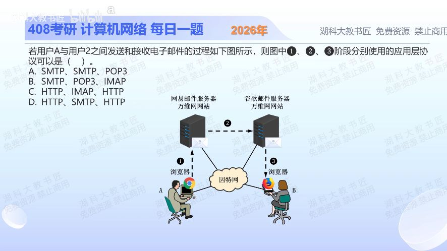

[目录](README.md)　·　[« 2025-1028](1028.md)　·　[2025-1030 »](1030.md)

# 2025-10-29

[原视频](https://www.bilibili.com/video/BV13tyzBCEX4/)

<!-- review-lesson -->

## 先合上解析

给三条箭头各写通信端点，再确定协议。SMTP出现在哪两种角色之间？

展开解析与逐项判断

先认通信双方。①与③是用户用浏览器访问万维网站上的邮箱，浏览器与网站交互使用HTTP（现实常用加TLS的HTTPS）；②是不同邮件服务器之间转递邮件，使用SMTP。

顺序因此为HTTP、SMTP、HTTP，选 **D**。A对应传统邮件客户端发送/服务器转递/POP3取信的另一种场景，与图中的浏览器不符；B把服务器间转递写成POP3；C把它写成IMAP，均不对。

不要只看到“发送邮件”就把用户所有操作都判成SMTP；网页邮箱的前端交互与后端邮件转递是两段不同的连接。

只核对复盘检查

本题①③浏览器↔网站是HTTP，②邮件服务器↔邮件服务器是SMTP。

## 换一个条件

若两端改成专用邮件客户端，发送端通过邮件提交服务，接收端用IMAP同步，三阶段如何写？

完成后核对

SMTP、SMTP、IMAP。发送客户端到服务器与服务器间都可用SMTP体系，收信也可依配置使用POP3而不是IMAP。

关联：[应用层协议与承载](0910.md)。

[复习入口](../../review/README.md) · 解析已补全，个人是否掌握以独立作答为准。
