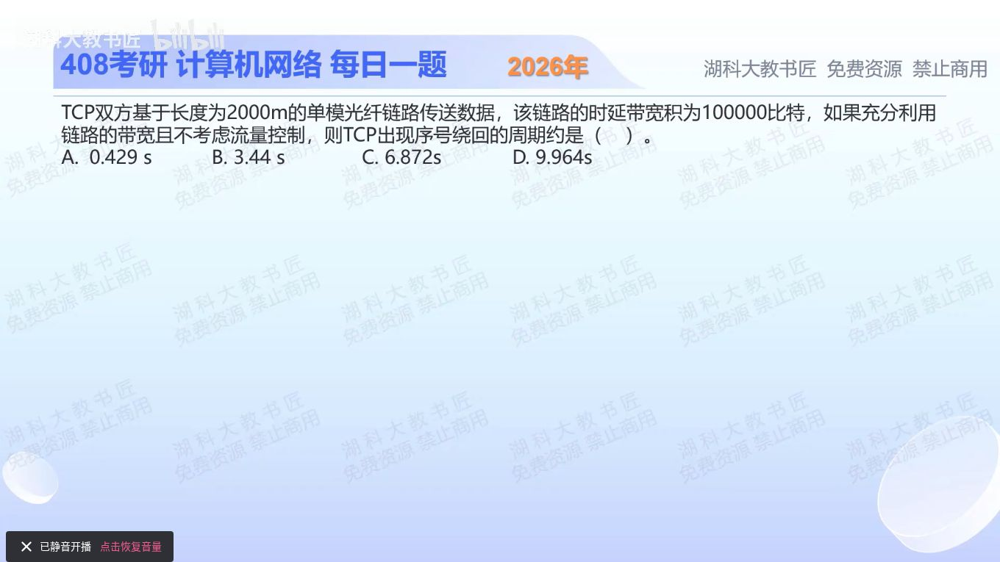

[目录](README.md)　·　[« 2025-1029](1029.md)　·　[2025-1031 »](1031.md)

# 2025-10-30

[原视频](https://www.bilibili.com/video/BV1rHysBnED8/)

<!-- review-lesson -->

## 先合上解析

32位序号覆盖的是2³²个什么？从BDP恢复速率时用单程还是往返传播时间？

展开解析与逐项判断

采用光纤常用传播速率2×10⁸m/s，2000m单程传播10μs。时延带宽积为100000bit，因此发送速率R=100000/(10×10⁻⁶)=10¹⁰bit/s。

TCP序号32位，但按字节编号。完整绕回需发送2³²字节，即2³²×8比特；时间为2³²×8/10¹⁰≈**3.44s，选B**。A约0.429s漏字节到比特的8倍；C约为正确值两倍，常来自把单程传播混成RTT；D不符合上述量纲计算。

题图未明给光纤传播速率，答案使用教材常用2×10⁸m/s。若换传播速率或计入协议开销，结果随之改变；本题忽略这些额外因素。

只核对复盘检查

覆盖2³²字节编号；BDP按单程传播时延定义，10μs。

## 换一个条件

同样链路速率下若每个序号改为标记一个比特，绕回时间变为多少？

完成后核对

约0.4295s，是原来的1/8；这正说明本题不能漏掉字节单位。

关联：[发送与传播](1002.md)；[TCP确认号](1107.md)。

[复习入口](../../review/README.md) · 解析已补全，个人是否掌握以独立作答为准。
