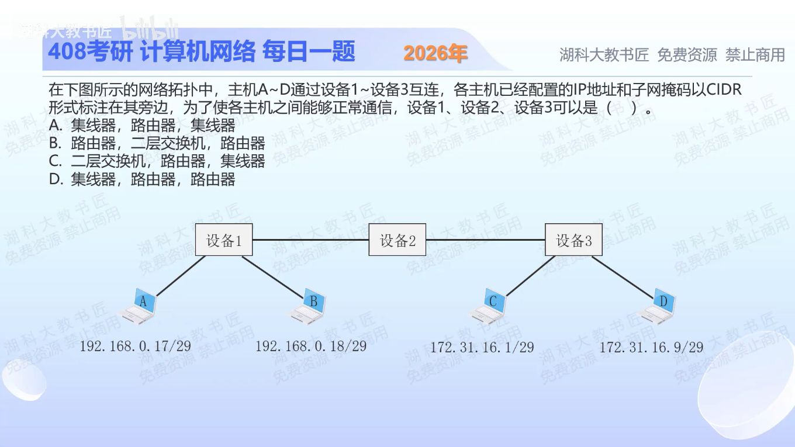

[目录](README.md)　·　[« 2025-1030](1030.md)　·　[2025-1101 »](1101.md)

# 2025-10-31

[原视频](https://www.bilibili.com/video/BV16FyYBqEJ1/)

<!-- review-lesson -->

## 先合上解析

先独立算A/B、C/D的网络号，再决定哪里必须跨子网。

展开解析与逐项判断

/29每块8个地址。A .17与B .18同属192.168.0.16/29，设备1可用集线器或二层交换机把它们接入同一链路。C 172.31.16.1属于.0/29，D .9属于.8/29，是两个不同IP子网，设备3需要三层转发能力。

逐项看：A、C都把设备3设成集线器，不能连接这两个子网；B把设备1设成普通路由器，将同一子网A、B接在其不同路由接口上，不符合本题常规接口模型；D为集线器、路由器、路由器，能够配置相应网关与路由，选 **D**。

题目判的是普通设备角色。若让路由器另带交换模块、桥接模式或代理ARP，已加入题中没有的额外能力，不作为排选依据。

只核对复盘检查

A/B均.16/29；C为172.31.16.0/29，D为172.31.16.8/29，右侧必须路由。

## 换一个条件

若D改成172.31.16.2/29，设备3还必须是路由器吗？

完成后核对

不必须，C/D同属.0/29，设备3可二层接入；左右不同网络间仍需某处提供路由。

关联：[CIDR边界](1017.md)。

[复习入口](../../review/README.md) · 解析已补全，个人是否掌握以独立作答为准。
