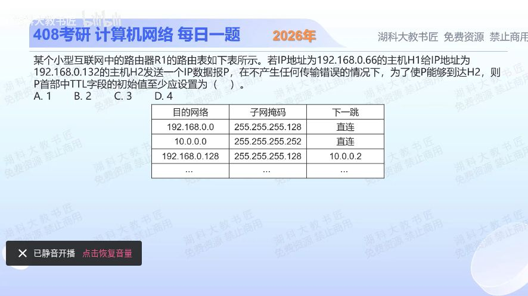

[目录](README.md)　·　[« 2025-1031](1031.md)　·　[2025-1102 »](1102.md)

# 2025-11-01

[原视频](https://www.bilibili.com/video/BV1Wv1TBrEvT/)

<!-- review-lesson -->

## 先合上解析

下一跳是一个IP而非“直接”能推出什么、不能推出什么？

展开解析与逐项判断

H1 .66属于192.168.0.0/25，H2 .132属于192.168.0.128/25。R1到H2网络的下一跳是10.0.0.2，说明不是R1直接交付，至少还经过该邻居路由器，最少路径有两台转发路由器。

TTL每经过一台转发路由器减1；若减到0不能继续转发。两台路由器要依次以2、1转发，源TTL至少3，因此按题目求“可能所需的最小值”的口径选 **C**。A、B会在第一或第二台路由器到0；D比该最小下界多1。

取证限制：只给R1路由表，并不能严格保证10.0.0.2之后一定直连H2。若后续还有更多路由器，TTL3未必够。表能推出至少两跳路由转发和TTL下界3，不能证明完整拓扑的精确长度。

只核对复盘检查

至少还要邻居路由器转发；不能凭这张表证明邻居后面没有更多路由器。

## 换一个条件

若完整拓扑明确源与目的之间有4台转发路由器，TTL最少多少？

完成后核对

5；依次减到4、3、2、1后可交付主机。主机本地接收不再作为转发路由器减到0。

关联：[路由环路与TTL](1024.md)。

[复习入口](../../review/README.md) · 解析已补全，个人是否掌握以独立作答为准。
