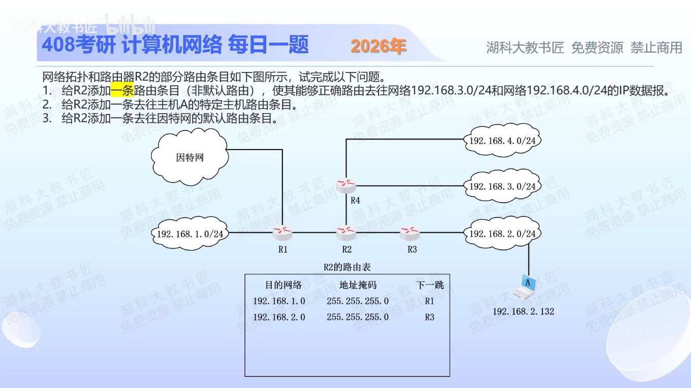

[目录](README.md)　·　[« 2025-1101](1101.md)　·　[2025-1103 »](1103.md)

# 2025-11-02

[原视频](https://www.bilibili.com/video/BV1hj1jB1ECy/)

<!-- review-lesson -->

## 先合上解析

不看表，给.3与.4写二进制求公共前缀。为什么新增聚合不改变去.2.132的既有方向？

展开解析与逐项判断

（1）只能加一条非默认项，要同时覆盖192.168.3.0/24和192.168.4.0/24，先看第三字节：3=00000011，4=00000100，共同前缀只有前5位00000。加上前两字节16位，聚合为192.168.0.0/21，掩码255.255.248.0，下一跳R4。

它也覆盖.0—.7的其他网络；现有.1/24→R1、.2/24→R3更具体，最长前缀匹配优先，所以不会被/21抢走。但其他额外覆盖的网络若真实存在，需要另行精确路由；无法用一条CIDR只覆盖不对齐的.3和.4两个/24。

（2）主机A的特定路由：192.168.2.132/32，掩码255.255.255.255，下一跳R3。（3）默认路由：0.0.0.0/0，掩码0.0.0.0，下一跳R1。图没有接口IP，按图用路由器名称表示下一跳；实际配置需换为可直达的邻居接口IP。

三项最终分别为 /21→R4、/32→R3、/0→R1。不要把.3/.4相邻就误聚合成/23；CIDR还必须满足二进制边界对齐。

只核对复盘检查

公共21位得到192.168.0.0/21；原.2/24比/21更长，若加主机/32则更优先，均指R3。

## 换一个条件

若要聚合.2.0/24和.3.0/24，最小单条前缀是什么？

完成后核对

192.168.2.0/23，掩码255.255.254.0；这两个块在/23边界上对齐。

关联：[直连/静态路由](1020.md)；[CIDR划分](1018.md)。

[复习入口](../../review/README.md) · 解析已补全，个人是否掌握以独立作答为准。
