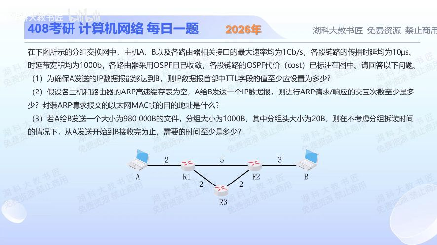

[目录](README.md)　·　[« 2025-1102](1102.md)　·　[2025-1104 »](1104.md)

# 2025-11-03

[原视频](https://www.bilibili.com/video/BV1x9yoBUEwY/)

<!-- review-lesson -->

## 先合上解析

先选路径，再求速率，最后数包。为什么不是走路由器最少的路线？为什么不是用1Gb/s？

展开解析与逐项判断

（1）OSPF按代价和选路。R1直达R2代价5，经R3为2+2=4，故路径A→R1→R3→R2→B，共3台转发路由器，初始TTL至少4。

（2）ARP缓存空，需要沿4段链路各解析一次下一跳：A问R1、R1问R3、R3问R2、R2问B，最少4次请求/响应交换。ARP请求的以太网目的地址均为FF-FF-FF-FF-FF-FF，不是B的MAC；广播不会跨路由器传播。

（3）先由每段BDP=1000bit、传播10μs推出链路速率100Mb/s。各接口最高1Gb/s只是上限，不能盖过题给链路参数。每包总1000B，其中有效980B，所以980000/980=1000包；每包发送时间8000/10⁸=80μs。4段存储转发流水线，首包需4×(80+10)=360μs，后999包每80μs交付一个，总时间360+999×80=80280μs=**80.28ms**。

时间按题目通常数据传输模型，忽略排队、处理、其他封装与分组装配；ARP报文大小和处理时间未给，不能额外编造ARP耗时计入数值。OSPF代价用于选路，不直接当作微秒加总。

只核对复盘检查

OSPF选总代价4而非5；BDP/传播时延给出100Mb/s实际链路速率。

## 换一个条件

若R1—R2代价改为3，其余不变，新路径的TTL下界、ARP次数与数据时间分别怎样变化？

完成后核对

走A—R1—R2—B，TTL≥3，ARP3次；3段流水线时间(1000+2)×80+3×10=80190μs=80.19ms。

关联：[流水线分组](1001.md)；[ARP逐跳与IP端到端](1104.md)。

[复习入口](../../review/README.md) · 解析已补全，个人是否掌握以独立作答为准。
