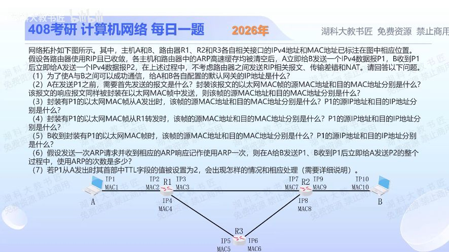

[目录](README.md)　·　[« 2025-1103](1103.md)　·　[2025-1105 »](1105.md)

# 2025-11-04

[原视频](https://www.bilibili.com/video/BV1qh1hBaEms/)

<!-- review-lesson -->

## 先合上解析

不看解析，给去程三段各写MAC源/目的，再写一遍IP源/目的；它们哪一层随跳改变？

展开解析与逐项判断

先定路：RIP按跳数，R1直达R2比经R3少一跳，故P1为A→R1→R2→B，P2反向。题设排除NAT，IP端点在途中不变。

（1）A默认网关IP2，B默认网关IP9，均取本地链路上的路由器接口。

（2）A先发ARP请求查询IP2：源MAC1，目的广播FF-FF-FF-FF-FF-FF。R1的ARP响应源MAC2、目的MAC1。

（3）A发P1的帧：源MAC1、目的MAC2；IP源IP1、目的IP10。（4）R1向R2转发P1：帧源MAC3、目的MAC7；IP仍IP1→IP10。（5）B收到的帧：源MAC9、目的MAC10；IP仍IP1→IP10。

（6）往返合计最少3次ARP交换：A解析R1、R1解析R2、R2解析B。ARP请求带发送者IP/MAC，接收者在应答时已学到反向映射；P2可复用这些新缓存，不必机械再加3次。

（7）初始TTL=2时，R1减为1并转发；R2准备转发时减到0，丢弃P1，向源A发送ICMP时间超过（转发生存时间耗尽）报文，IP目的为IP1。B收不到P1，自然不会按题设回P2。ICMP经R1返回A，其新IP首部的TTL不是拿已经归零的P1继续用。

只核对复盘检查

MAC1→MAC2、MAC3→MAC7、MAC9→MAC10；三段IP均IP1→IP10。链路封装每跳更换。

## 换一个条件

若把路由协议换成OSPF，并设R1—R2代价10、经R3两段各2，R1转发P1时帧地址如何变化？

完成后核对

路径改经R3；R1发出的帧MAC4→MAC5，IP仍IP1→IP10。改变的是选路和下一跳链路封装。

关联：[OSPF路径与ARP](1103.md)；[TTL环路](1024.md)。

[复习入口](../../review/README.md) · 解析已补全，个人是否掌握以独立作答为准。
