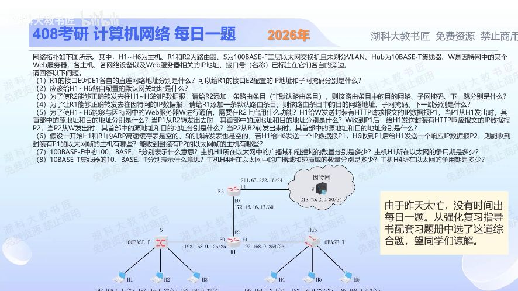

[目录](README.md)　·　[« 2025-1104](1104.md)　·　[2025-1106 »](1106.md)

# 2025-11-05

[原视频](https://www.bilibili.com/video/BV1Bu1CBNEoA/)

<!-- review-lesson -->

## 先合上解析

先不做8问全套，只闭卷画出三个网段、两条网关、一次NAT前后地址；再解释为什么交换机初始表空却不必把P1泛洪。

展开解析与逐项判断

先把两侧LAN和中间点对点网段分清，再沿IP与MAC两层追踪。

（1）R1 E0直连192.168.0.0/25；E1直连192.168.0.128/25。R2 E0为172.16.16.17/30，该块是172.16.16.16/30，可用.17、.18，所以R1 E2配172.16.16.18，掩码255.255.255.252。

（2）H1—H3网关192.168.0.126；H4—H6网关192.168.0.254。（3）R2新增192.168.0.0/24，掩码255.255.255.0，下一跳172.16.16.18，两半/25恰可合并。（4）R1默认路由0.0.0.0/0，下一跳172.16.16.17。

（5）需在R2启用NAT，实际多主机共享一个公网IP通常用NAPT。题图唯一给定可用公网接口地址为211.67.222.16，因此采用它作转换地址：P1离开H1及R1时均192.168.0.11→218.75.230.30；离开R2后211.67.222.16→218.75.230.30。P2离开W时218.75.230.30→211.67.222.16；经R2反向转换后218.75.230.30→192.168.0.11。若另配公网地址池则公网源值需按池规则确定，图中未给，不能编造。

（6）初始H1/R1的ARP与交换机S的转发表为空。H1先ARP网关，S从源MAC学习H1端口；R1回应又使S学到网关端口。随后P1已是发给网关的已知单播，不会泛洪到H2/H3。R1转发到Hub侧时，Hub物理复制，H4、H5、H6都能收到承载P1的帧，只有H6作为目的交付IP层。回来的P2在Hub侧H4、H5也能听到，经S按已学H1端口转发，H1收到；因此问“能收到以太网帧”的主机集合：P1为H4、H5、H6；P2为H4、H5、H1。不要混成“谁接收了ARP广播”或“谁最终接收IP数据”。

（7）100表示100Mb/s，BASE为基带，F为光纤。按传统教材的交换机端口冲突域划分，左LAN有1个广播域、4个独立冲突域（3台主机加路由器共4个活动端口）。若采用半双工CSMA/CD，争用期为512bit/100Mb/s=5.12μs；全双工交换以太网不发生冲突，也不使用CSMA/CD争用期。题图未指定双工，不能把5.12μs当所有交换链路必有的等待。

（8）10表示10Mb/s，BASE基带，T双绞线；Hub右LAN为1个广播域、1个共享冲突域，争用期512bit/10Mb/s=51.2μs。广播域在R1接口处隔开，Hub和未划VLAN的二层交换机都不隔离各自LAN内广播。

只核对复盘检查

ARP阶段先学习了H1和网关的MAC位置，之后P1已能定向转发。网段为两个/25加172.16.16.16/30。

## 换一个条件

若去掉H1此前的ARP，并直接注入一个目的MAC尚未学习的单播帧到S，H2/H3是否可能收到？

完成后核对

会，未知单播会向除入端口之外的其他端口泛洪。原题不能这么处理，因为真实发送顺序先经过ARP，已改变转发表。

关联：[逐跳ARP与MAC](1104.md)；[CIDR聚合](1102.md)。

[复习入口](../../review/README.md) · 解析已补全，个人是否掌握以独立作答为准。
