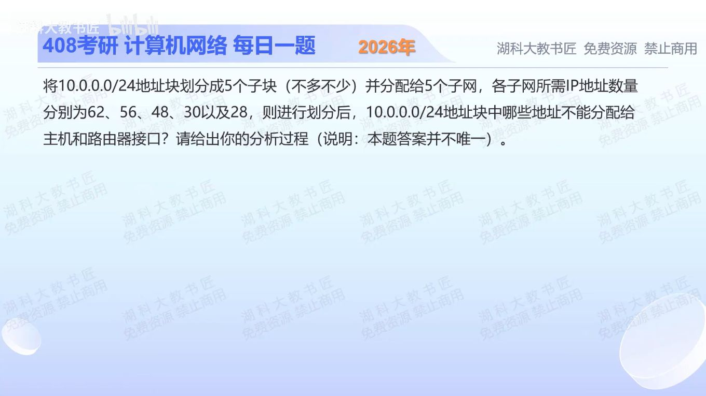

[目录](README.md)　·　[« 2025-1105](1105.md)　·　[2025-1107 »](1107.md)

# 2025-11-06

[原视频](https://www.bilibili.com/video/BV1aS1WBKEed/)

<!-- review-lesson -->

## 先合上解析

为什么48也要/26，而30恰好可/27？写出完整256地址的容量账。

展开解析与逐项判断

按普通子网需保留网络与广播地址，容量取满足2^h−2≥需求的最小h。62、56、48分别需要64个地址的/26；30、28分别需要32个地址的/27。合计64×3+32×2=256，恰好完整用尽/24，不多不少5块。

一种合法方案为：10.0.0.0/26（主机.1—.62）；10.0.0.64/26（.65—.126）；10.0.0.128/26（.129—.190）；10.0.0.192/27（.193—.222）；10.0.0.224/27（.225—.254）。各自满足对应需求。

此方案不能分配给普通主机/路由接口的10个地址为：网络地址.0、.64、.128、.192、.224；广播地址.63、.127、.191、.223、.255（均带10.0.0前缀）。其他方案可调子网位置，但必须满足CIDR对齐、互不重叠、完整覆盖及每个需求。

只核对复盘检查

/27仅30个可用，48放不下；3×64+2×32=256。

## 换一个条件

若最后一个需求从28变成31，原/24还能容纳全部需求吗？

完成后核对

不能，31需/26而非/27，总容量变64×4+32=288>256；不能仅看需求数字总和仍不大就宣布可行。

关联：[最小CIDR子块](1018.md)。

[复习入口](../../review/README.md) · 解析已补全，个人是否掌握以独立作答为准。
