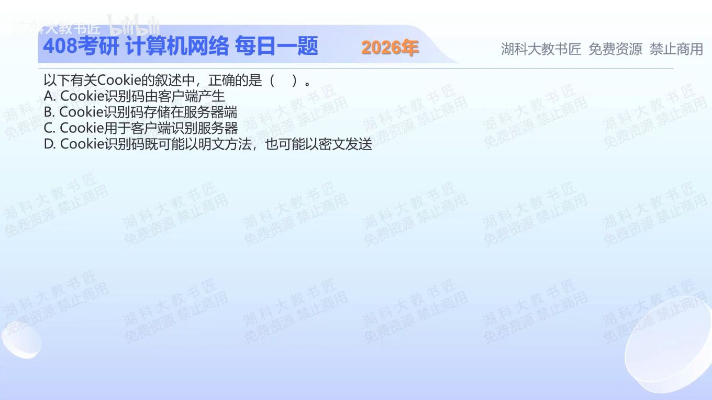

[目录](README.md)　·　[« 2025-1106](1106.md)　·　[2025-1108 »](1108.md)

# 2025-11-07

[原视频](https://www.bilibili.com/video/BV1sA2MBjEiY/)

<!-- review-lesson -->

## 先合上解析

画出Set-Cookie的方向和下一次Cookie的方向；加密发生在哪一层？

展开解析与逐项判断

按题目的典型会话Cookie模型，服务器通过Set-Cookie下发识别信息，浏览器保存并在符合域/路径等条件的请求中带Cookie。使用HTTP时可能以明文在网络上传送，使用HTTPS时由TLS保护传输，因此 **D正确**。

A把典型会话标识的产生端反了；B把浏览器保存的Cookie与服务器可能保存的会话记录混为一谈；C将主要识别方向反了，典型用途是服务器关联客户端会话，不是客户端认证服务器。

边界要分清：脚本也能设置某些Cookie，服务器也可能存储对应标识/会话映射。因此A、B不应扩大成“现实绝不可能”，这里只是相对于题目简化的服务器下发Cookie流程而言不成立。HTTPS保护传输，不代表Cookie值自身必须预先加密。

只核对复盘检查

服务器→浏览器设置，浏览器→服务器回送；HTTPS的TLS保护传输。

## 换一个条件

服务器不建立会话数据库，改用签名的自包含Cookie，会话Cookie还一定需要服务端存同一条记录吗？

完成后核对

不一定；服务器可验证签名并读取内容。存储模型和传输是否加密是两个独立问题。

关联：[无状态HTTP与会话](0921.md)。

[复习入口](../../review/README.md) · 解析已补全，个人是否掌握以独立作答为准。
