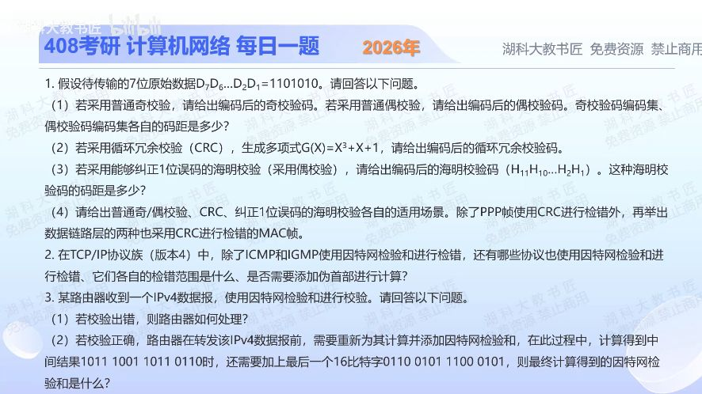

[目录](README.md)　·　[« 2025-1107](1107.md)　·　[2025-1109 »](1109.md)

# 2025-11-08

[原视频](https://www.bilibili.com/video/BV1fX2KBPEyT/)

<!-- review-lesson -->

## 先合上解析

分四次独立算：奇偶位、CRC余数、海明四组校验、16位进位回卷。每次写清位序与单位。

展开解析与逐项判断

**1（1）奇偶校验。**原数据1101010有4个1。若把校验位追加在右端，奇校验码11010101，偶校验码11010100；若题目规定校验位在左，应相应换位置。两种普通奇/偶校验码集合的最小码距都为2，可检出任意奇数位翻转，不能定位纠错，也不能保证检出偶数位翻转。

**1（2）CRC。**G=x³+x+1对应1011，数据后补3个0得到1101010000，模2除法只做异或。余数101，发送码为1101010101；把整个发送码再除1011应余0，这是自检步骤。

**1（3）海明码。**7位数据需r=4，因为2⁴≥7+4+1。校验位放H1、H2、H4、H8；数据D1到D7依次放H3、H5、H6、H7、H9、H10、H11，得到H3=0、H5=1、H6=0、H7=1、H9=0、H10=1、H11=1。偶校验各组异或给H1=1、H2=1、H4=0、H8=0；按题求H11…H1写为**11001010011**。普通纠1位海明码最小码距3；没有额外全局校验位时不能把它当SECDED。

**1（4）场景。**普通奇偶校验开销小，适合只需简单检错的场景；CRC适合链路上的突发差错检测；纠1位海明码适合需要直接纠正单比特错误的场景。除PPP外，以太网MAC帧、IEEE 802.11无线MAC帧都使用CRC形成FCS。检错能力不等于能自动修正，也不等于全部多位错误必被检出。

**2 Internet检验和。**IPv4仅覆盖IP首部，不加伪首部；TCP覆盖TCP首部与数据，并纳入IP伪首部；UDP覆盖UDP首部与数据，也纳入伪首部。伪首部参与计算但不是再在线上插入一份新的IP首部。IPv4的UDP可用全0字段表示未使用检验和，不能据此说UDP算法没有该字段。

**3（1）**IP首部校验出错则丢弃，通常不返回ICMP错误，因为首部地址本身也可能已坏。**3（2）**路由转发改变TTL，须更新首部检验和。按题给“中间累计和”口径，0xB9B6+0x65C5=0x11F7B，进位回卷得到0x1F7C，最后取反为**0xE083=1110 0000 1000 0011**。不要漏进位回卷，也别把已取反的检验和值当原累计和继续相加。

只核对复盘检查

奇1偶0；CRC余101；H1,H2,H4,H8为1,1,0,0；最后校验和0xE083。

## 换一个条件

若校验传输时恰好翻转2位，普通偶校验保证检出吗？普通纠1位海明译码器能保证正确修复吗？

完成后核对

偶校验不保证检出；普通码距3的海明码也不能保证纠正2位，按单错纠正可能误纠。不能把“可检测2位”的码距性质等同于单错译码器能可靠区分所有单错与双错。

关联：[海明综合症](0913.md)；[UDP反码和](1022.md)；[CRC多项式](1023.md)。

[复习入口](../../review/README.md) · 解析已补全，个人是否掌握以独立作答为准。
