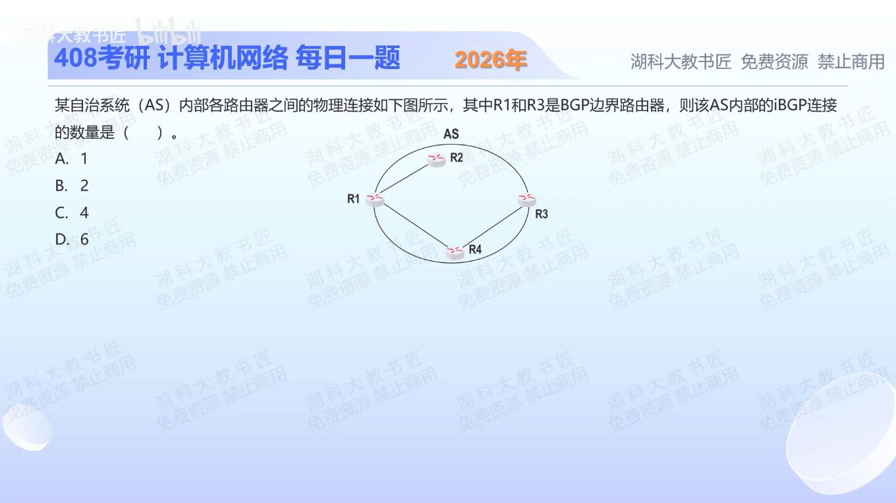

[目录](README.md)　·　[« 2025-1108](1108.md)　·　[2025-1110 »](1110.md)

# 2025-11-09

[原视频](https://www.bilibili.com/video/BV1Bx1QBxEyC/)

<!-- review-lesson -->

## 先合上解析

连接数应数物理链路还是BGP发言人之间的逻辑会话？这题得1依赖哪个隐含条件？

展开解析与逐项判断

按题图通常的最小部署解读，只有明确指定的边界路由器R1、R3作为BGP发言人，需要在同一AS内建立一条R1—R3的iBGP会话，选 **A（1）**。iBGP是TCP逻辑会话，可经内部路由多跳到达；不要求R1、R3有直接物理连线。

B把一条双向会话当成两个单向连接；C可能误数设备或链路；D的6等于4个BGP发言人的完全网状会话数4×3/2，但题图没有说R2、R4也运行BGP。

严格边界：题目只说R1、R3是边界路由器，并不能在真实网络中排除R2、R4也运行iBGP。若四台都参与且采用全互连，则为6；若使用路由反射器又不同。因此1是本题默认最小BGP部署口径，物理拓扑本身不能唯一决定会话数量。

只核对复盘检查

数逻辑会话；依赖只有R1、R3参与BGP的最小部署假设。

## 换一个条件

若明确说四台全运行BGP、采用传统全互连且无路由反射器，共多少会话？

完成后核对

4×3/2=6条；每对发言人一条，不按双方向再乘2。

关联：[BGP路径选择](0923.md)。

取证边界：[RFC 4271 §9.2](https://www.rfc-editor.org/rfc/rfc4271.html#section-9.2)讨论内部对等体之间的路由传播；全互连的参与者是BGP发言人，不自动等于所有物理路由器。

[复习入口](../../review/README.md) · 解析已补全，个人是否掌握以独立作答为准。
