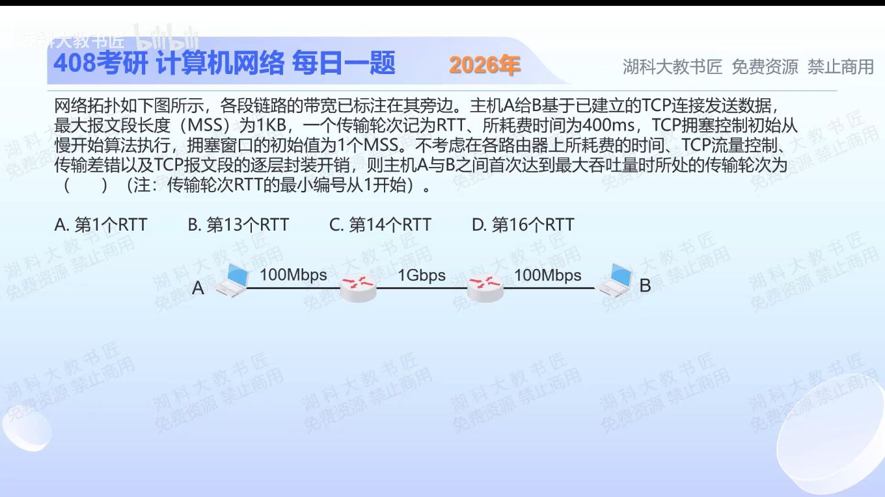

[目录](README.md)　·　[« 2025-1109](1109.md)　·　[2025-1111 »](1111.md)

# 2025-11-10

[原视频](https://www.bilibili.com/video/BV1S7kDBwE7x/)

<!-- review-lesson -->

## 先合上解析

先算填满RTT需要多少字节，再列第13/14轮窗口。第1轮的指数为什么是0？

展开解析与逐项判断

端到端瓶颈为100Mb/s，RTT=0.4s。要让窗口/RTT达到瓶颈，需要在途窗口至少100×10⁶×0.4=40×10⁶bit，即5,000,000B，约4882.8个1KiB MSS（若按十进制KB则5000个，轮次相同）。

第1轮窗口1MSS，持续慢开始且未提前碰到阈值时，第n轮为2^(n−1)MSS。第13轮4096MSS仍不足，第14轮8192MSS首次足够，因此选 **C**。A初始窗口远远不够；B错把从1开始的轮次与指数混为一谈；D超过首次达到的轮次。

题目没有给ssthresh，计算按在达到瓶颈前持续慢开始的理想设定；实际若阈值更低或发生丢包，就不能照搬这条指数增长结论。

只核对复盘检查

所需5MB；13轮4096MSS，14轮8192MSS；初始窗口2⁰=1。

## 换一个条件

若初始拥塞窗口为4MSS，其余理想条件不变，首次饱和在第几轮？

完成后核对

第12轮：4×2¹¹=8192MSS；第11轮4096仍不够。

关联：[TCP序号绕回](1030.md)；[窗口利用率](1028.md)。

[复习入口](../../review/README.md) · 解析已补全，个人是否掌握以独立作答为准。
