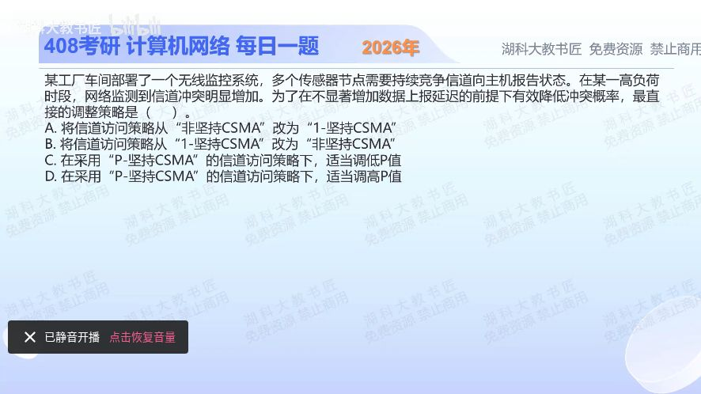

[目录](README.md)　·　[« 2025-1110](1110.md)　·　[2025-1112 »](1112.md)

# 2025-11-11

[原视频](https://www.bilibili.com/video/BV18jCwBaExY/)

<!-- review-lesson -->

## 先合上解析

为什么题目同时限定“降低冲突”和“不显著增加延迟”？用它解释B与C的区别。

展开解析与逐项判断

多个站高负载竞争时，要降低同时抢发的概率，又不希望引入过大的随机等待，最直接的可调参数是在p-坚持CSMA中适当降低p，选 **C**。空闲时各站以概率p发送，适当下调可分散尝试。

A改成1-坚持使一空闲就集中发送，更易冲突；B改非坚持虽可能降低冲突，却增加退避等待，不如直接微调p贴合题目目标；D提高p会增加高竞争时同槽并发概率。

“适当”不能删掉。p太小会让信道空着、增加时延，并非越小越好。以n站独立竞争的简单时隙模型为例，恰一站成功概率np(1−p)^(n−1)，其最佳p为1/n；真实负载变化下需调整，而非一律取极小值。

只核对复盘检查

非坚持引入随机等待；调整p可在冲突与空闲之间做细粒度折中，但不能保证零时延代价。

## 换一个条件

在简化的10站同时竞争模型中，恰一站成功概率如何写？最优p大约多少？

完成后核对

10p(1−p)⁹，最优p=0.1；这是独立同槽模型的推导，不是所有系统固定参数。

关联：[退避冲突概率](1012.md)。

[复习入口](../../review/README.md) · 解析已补全，个人是否掌握以独立作答为准。
