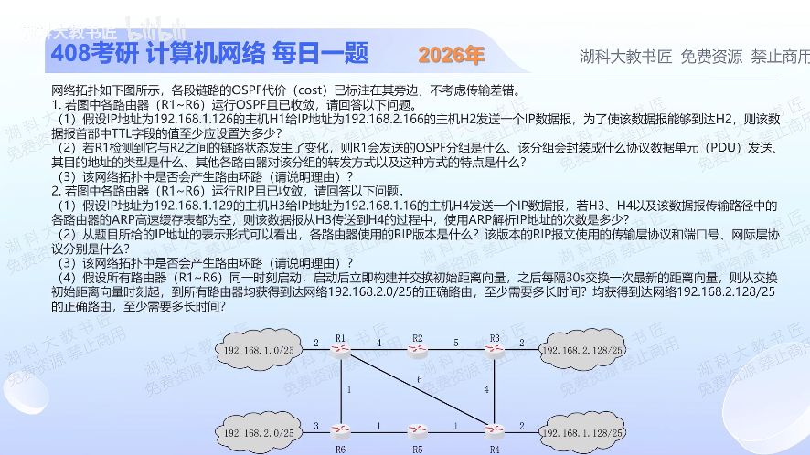

[目录](README.md)　·　[« 2025-1111](1111.md)　·　[2025-1113 »](1113.md)

# 2025-11-12

[原视频](https://www.bilibili.com/video/BV1EpkkBdE32/)

<!-- review-lesson -->

## 先合上解析

同一张图分别按代价和跳数选路；再从R6按无权图画三层邻居，标0、30、60秒。

展开解析与逐项判断

**1 OSPF。**（1）H1 .1.126在R1侧192.168.1.0/25，H2 .2.166在R3侧192.168.2.128/25。R1到R3：上路4+5=9，斜路6+4=10，下路R1→R6→R5→R4→R3为1+1+1+4=7，最小。共经5台转发路由器R1、R6、R5、R4、R3，TTL至少6；两端LAN代价对所有候选路径相同，不改变比较。

（2）R1检测链路变化，生成/更新LSA并通过LSU携带。OSPF直接封装于IP数据报，协议号89，通常用组播目的地址（AllSPFRouters 224.0.0.5，广播网依DR角色也可能用224.0.0.6；重传等可单播）。其他路由器通过可靠泛洪传播新的LSA：向符合条件的邻接转发、用序列号/年龄等抑制旧副本并确认，最终同步区域内LSDB。不能说“把一个TTL=1的组播IP包跨整个AS原样转发”，逐邻接传播与普通IP组播转发不同。

（3）在题设已收敛、同区域数据库一致的稳态，最短路径计算不会形成该目的的转发环路；收敛过程中仍可能短暂出现转发微环路，不能概括为OSPF任何时刻绝无环路。

**2 RIP。**（1）H3 .1.129在R4侧，H4 .1.116在R1侧；RIP按跳数选R4→R1直连斜边，不看其OSPF代价6。路径H3→R4→R1→H4，各段一次ARP，共3次。

（2）考试通常期望支持携带掩码的RIPv2：UDP端口520，通常组播目的224.0.0.9。严格说仅看本图地址写了/25，不能排除在所有相关子网统一掩码等限制下运行RIPv1；“有CIDR写法”本身不是版本字段的证据。本题按RIPv2教材意图回答，并保留这个条件边界。

（3）题设已收敛时正常无路由环路；距离向量算法在故障及收敛期间可能环路/计数到无穷，水平分割、毒性逆转等用于缓解，不能保证所有多节点临时环路都不存在。

（4）按题设同步周期、初始交换时刻计为t=0且忽略交换耗时：一条已知直连路由每轮向外扩展一跳。192.168.2.0/25接R6，最远R3距3条路由器链路；192.168.2.128/25接R3，最远R6同为3跳。t=0完成第1跳、t=30完成第2跳、t=60完成第3跳，两者均至少60s。若把第一次交换完成算t=30会多算一轮，不符合题目起算点。

只核对复盘检查

OSPF到R3走下路；RIP R4到R1走斜边。信息经过3跳，首轮已在0秒发生，最后60秒到达。

## 换一个条件

若R1到R4的OSPF代价由6降到1，到R3会改走哪里，TTL下界多少？

完成后核对

斜路1+4=5，小于下路7和上路9；经R1、R4、R3三台，TTL≥4。

关联：[OSPF与RIP路径](1103.md)；[数据库同步顺序](1113.md)。

取证边界：[RFC 2328](https://www.rfc-editor.org/rfc/rfc2328.html)；[RFC 2453](https://www.rfc-editor.org/rfc/rfc2453.html)。

[复习入口](../../review/README.md) · 解析已补全，个人是否掌握以独立作答为准。
