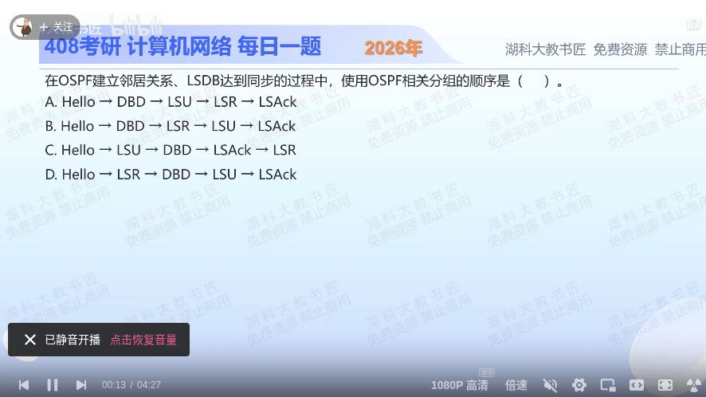

[目录](README.md)　·　[« 2025-1112](1112.md)　·　[2025-1114 »](1114.md)

# 2025-11-13

[原视频](https://www.bilibili.com/video/BV1EKC7BsEo8/)

<!-- review-lesson -->

## 先合上解析

把五个缩写换成动作：发现、对目录、索取、交付、签收，再恢复名称。

展开解析与逐项判断

按建立邻接并同步数据库的概念流程：Hello发现并维持邻居；DBD交换数据库摘要；发现缺失或过旧的LSA后用LSR请求；对方用LSU携带所需LSA；LSAck确认收到。顺序 **Hello→DBD→LSR→LSU→LSAck，选B**。

A把应答更新放在请求前；C把更新放到摘要前、又把确认放请求前；D还没比摘要就先请求，均不合题设的标准逻辑链。

真实协议可能多次交换、并行处理、主动泛洪、隐式确认；不是每次见到LSU都必须先有一个LSR。这题是在问典型初始同步逻辑，别把示意顺序当所有运行报文的唯一时序。

只核对复盘检查

Hello、DBD、LSR、LSU、LSAck。DBD是摘要不是整份LSA正文。

## 换一个条件

双方摘要比较后没有缺失或较新条目，是否必须再向对方索取一遍全量LSA？

完成后核对

不必；没有需要请求的条目就不为了凑顺序机械生成全量LSR。

关联：[LSU泛洪](0928.md)；[链路变化](1112.md)。

[复习入口](../../review/README.md) · 解析已补全，个人是否掌握以独立作答为准。
