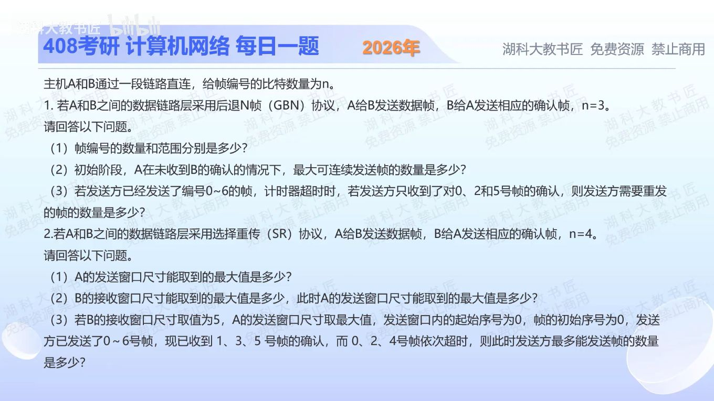

[目录](README.md)　·　[« 2025-1113](1113.md)　·　[2025-1115 »](1115.md)

# 2025-11-14

[原视频](https://www.bilibili.com/video/BV1GqCxBKEMD/)

<!-- review-lesson -->

## 先合上解析

对比GBN收到ACK5与SR收到ACK1/3/5后的左边界；在SR图上标出旧帧、新帧和可重传帧。

展开解析与逐项判断

**1 GBN，n=3。**（1）共有2³=8个编号，0—7。（2）发送窗口最大2³−1=7，未收到确认最多先连发7帧。（3）GBN累积确认，对5号帧的确认说明0—5均已正确收到；已发送0—6，超时只需重传6号，共1帧。题目说“对几号帧的确认”，不是TCP式“下一期待序号”，不要混用定义。

**2 SR，n=4。**序号空间16，通用安全约束Wt+Wr≤16。本题考察可不相等窗口，而不是先强制两窗相等。（1）接收窗至少1，故发送窗理论最大15（此时Wr=1，退化为GBN式接收）。（2）按本题教材同时约定Wr≤Wt，接收窗最大8，此时发送窗最大8。如果不附Wr≤Wt，只凭两窗和约束也能定义Wr>8、Wt<8的其他模型，需说明约定。

（3）Wr=5，所以Wt最大11，窗口起点0，范围0—10。已发0—6，1、3、5分别已确认，但0尚未确认，发送窗口不能越过0移动。0、2、4超时需分别重传，6尚未超时不重传；未发的新帧7—10还可发4帧。此时最多可发送3次重传+4个新帧=**7帧**；若问“新增数据帧”则只有4帧。

SR逐帧确认不等于收到任何ACK都可按数量任意滑动；左边界必须连续确认后才能前移。

只核对复盘检查

GBN已确认到5；SR起点仍0。SR可重传0/2/4并新发7/8/9/10，共7次发送。

## 换一个条件

若此时0、2、4也确认，而6仍未确认，Wt=11的发送窗左边界和范围是什么？

完成后核对

左边界移到6，范围6—16，按模16写为6—15及0；编号0此时属于新一轮，不能与旧0混淆。

关联：[GBN序号](1025.md)；[对称SR窗口](1027.md)。

[复习入口](../../review/README.md) · 解析已补全，个人是否掌握以独立作答为准。
