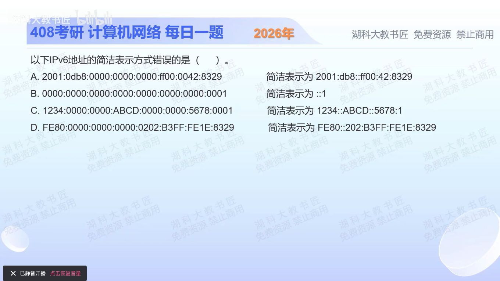

[目录](README.md)　·　[« 2025-1114](1114.md)　·　[2025-1116 »](1116.md)

# 2025-11-15

[原视频](https://www.bilibili.com/video/BV18DCuBHEzS/)

<!-- review-lesson -->

## 先合上解析

为什么两次::不是仅仅“不美观”，而是信息不足？把C恢复到8组试试看。

展开解析与逐项判断

IPv6每组可省略前导0；连续全0组可用一次“::”压缩。一个地址中最多出现一次“::”，否则无法唯一判断每处省了几组。

A把0db8→db8、0042→42并压缩连续3组0，正确；B七组0加1缩成::1，正确；C写成1234::ABCD::5678:1，两次::，错误，选 **C**；D压缩3组0并把0202→202，正确。

C可改为1234::ABCD:0:0:5678:1，或保留前两组0而压缩后两组。若要求RFC 5952规范形式，等长零串优先压左边一串；普通合法表示与唯一推荐书写规范要分开。

只核对复盘检查

只知道总共省了4组零，却无法唯一分配到两处；一个::时缺多少组由总数确定。

## 换一个条件

2001:db8:0:1:0:0:0:1的推荐压缩形式是什么？

完成后核对

2001:db8:0:1::1，压最长连续3组0，保留单独那组0。

关联：[IPv6性质](0919.md)。

[复习入口](../../review/README.md) · 解析已补全，个人是否掌握以独立作答为准。
