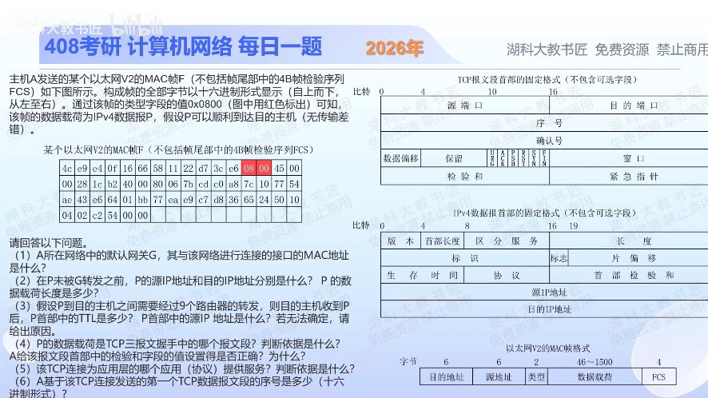

[目录](README.md)　·　[« 2025-1115](1115.md)　·　[2025-1117 »](1117.md)

# 2025-11-16

[原视频](https://www.bilibili.com/video/BV1wUCyB6Ehj/)

<!-- review-lesson -->

## 先合上解析

遮住解析，标出14、20、20三段边界；只从字节求源/目的IP、TTL、443、ACK和下一数据序号。

展开解析与逐项判断

先数偏移：以太网首部14B；IPv4首字节45意味着IPv4、首部5×4=20B；IP总长0x0028=40B，因此IP载荷20B。TCP从帧第34字节（从0计）开始。

（1）跨网段发给默认网关，帧的前6B目的MAC就是网关接口：**4C-E9-E4-0F-16-66**。源MAC为58-11-22-D7-3C-E6，别读反。

（2）IP源字节C0 A8 7C 10=**192.168.124.16**；目的77 54 AE 43=**119.84.174.67**；IP载荷20B，恰为无选项TCP首部，TCP应用数据0B。

（3）初始TTL0x80=128，过9台路由器后119。到达时源IP不能由题图唯一确定：原源为私有地址，若途中NAT会改写；未给转换规则，不能编造公网源。无NAT时才保持192.168.124.16。

（4）TCP数据偏移/标志50 10：首部20B、ACK=1、SYN=0，且无数据。在题目限定三次握手三报文之一的前提下，它是第三次握手ACK；单看ACK标志在一般流量里当然不能唯一证明是握手。检验和字段为C2 54，**按截图全部字节直接重算不正确**：IPv4伪首部为C0 A8 7C 10 77 54 AE 43 00 06 00 14，把TCP检验和置0进行16位反码和，正确值为0x4255；带入图给C254后的和为0x7FFF而非0xFFFF。不能因为“没有TCP数据”就将检验和忽略，TCP首部和伪首部仍参加计算。截图若来自发送前卸载抓包也可能出现未完成的校验字段，但题目没有这个信息，不能自行断言卸载就是原因。

（5）目的端口01 BB=443，按标准服务端口推断为HTTPS；源端口66 64=26212。仅端口不能在真实流量中证明应用内容，本题按常用端口对应作答。（6）第三次ACK序号77 EA E9 C7，纯ACK不消耗序号，因此A随后首个携带数据段的序号仍为**0x77EAE9C7**，不是再加1；SYN在前面已经消耗过1。

题图另一个简化：所列14+40=54B，不含FCS时仍少于以太网最小60B，未展示应有的6B填充。本题按展示的协议字段解码，不把未展示填充误读成TCP应用数据。

只核对复盘检查

14B以太网+20B IP+20B TCP；TTL128；端口443；ACK1/SYN0；纯ACK不耗序号。

## 换一个条件

若这个TCP段携带100B应用数据，且序号仍0x77EAE9C7，下一个新数据段从哪个序号开始？

完成后核对

加100(0x64)，得到0x77EAEA2B；TCP按字节而非按报文编号。

关联：[Internet检验和计算](1108.md)；[序号单位](1030.md)。

[复习入口](../../review/README.md) · 解析已补全，个人是否掌握以独立作答为准。
