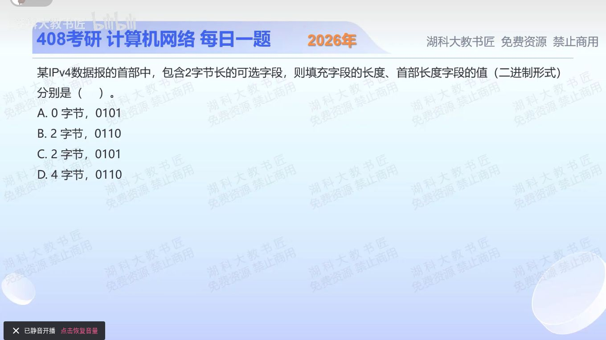

[目录](README.md)　·　[« 2025-1116](1116.md)　·　[2025-1118 »](1118.md)

# 2025-11-17

[原视频](https://www.bilibili.com/video/BV1HxCXBtE3a/)

<!-- review-lesson -->

## 先合上解析

先列20+2+p，再让总长被4整除。IHL写的是字节数还是4字节单位数？

展开解析与逐项判断

IPv4固定首部20B，选项2B，暂共22B。首部必须是4B的整数倍，要补2B到24B；首部长度IHL以4B为单位，24/4=6，二进制0110，所以选 **B**。

A漏选项和填充；C虽然填充数对，却把IHL仍写5，表示只有20B；D多填2B且总长26B也不对齐。别把“填充到4的倍数”误解成“固定再加4字节”。

只核对复盘检查

p=2，总长24，IHL=6。

## 换一个条件

选项5B或8B时，填充和IHL各是多少？

完成后核对

5B选项补3B，总长28、IHL7；8B选项不填充，总长28、IHL7。

关联：[IP选项另一题](../2026/0922.md)。

[复习入口](../../review/README.md) · 解析已补全，个人是否掌握以独立作答为准。
