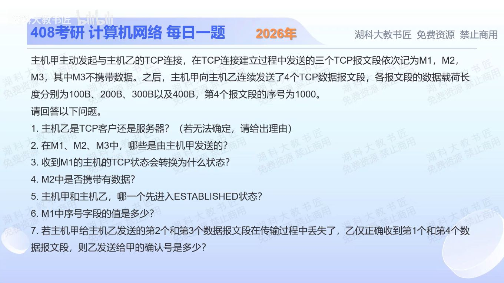

[目录](README.md)　·　[« 2025-1117](1117.md)　·　[2025-1119 »](1119.md)

# 2025-11-18

[原视频](https://www.bilibili.com/video/BV1trCvBWE6f/)

<!-- review-lesson -->

## 先合上解析

画两条独立的序号线：甲方向算399→400→500，乙方向不要混入。为什么先收到第4段不把ACK推进到1400？

展开解析与逐项判断

（1）能确定甲主动打开、乙被动打开；不能仅由谁发起TCP连接，绝对推出应用层谁是客户端/服务器，例如主动FTP数据连接可由服务器主动连接客户端。若题目以TCP主动/被动角色俗称客户端/服务器，则乙为被动服务端，须说明角色口径。

（2）甲发M1 SYN与M3 ACK；乙发M2 SYN+ACK。（3）通常被动打开的乙原为LISTEN，收到M1并发SYN+ACK后进入SYN-RECEIVED。（4）按本题普通三次握手模型，M2不带应用有效数据；SYN自身消耗一个序号，不是一个应用数据字节。扩展机制不是本题默认前提。（5）甲收到M2并发M3时先进入ESTABLISHED；乙收到M3后才进入。

（6）四个数据段起始序号依次相差100、200、300。第4段序号1000，倒推第1段1000−(100+200+300)=400。M3不带数据、不占序号；M1的SYN占1，故M1序号399。

（7）第1段覆盖400—499，第2段500—699丢失，第3段700—999丢失，第4段1000—1399虽收到，中间有洞。累计ACK始终确认下一个连续期待字节，所以为**500**，不是1400；SACK若使用可额外描述后面的已收块，但不改变累计ACK500。

只核对复盘检查

累计确认不能越过缺口；缺口从500开始。纯ACK不耗序号，SYN耗1。

## 换一个条件

若第2段补到但第3段仍丢，已缓存第4段，累计ACK变多少？若第3段也补到呢？

完成后核对

先变700；第3段补齐后可跨过已缓存第4段，变1400。

关联：[十六进制TCP段](1116.md)。

[复习入口](../../review/README.md) · 解析已补全，个人是否掌握以独立作答为准。
