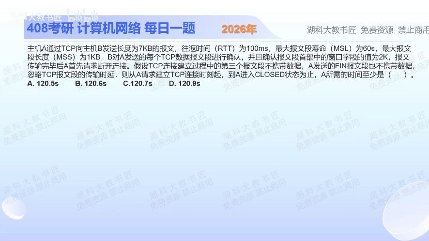

[目录](README.md)　·　[« 2025-1118](1118.md)　·　[2025-1121 »](1121.md)

# 2025-11-19

[原视频](https://www.bilibili.com/video/BV1Y7yGBvEEJ/)

<!-- review-lesson -->

## 先合上解析

在你的时间线上明确写：最后数据是“已发送”还是“已确认”才能发FIN？2MSL从哪个事件开始？

展开解析与逐项判断

先拆成建连、受窗口限制的数据传输、主动关闭后的等待。RTT=0.1s；2MSL=120s是主要时间项。7KB、MSS1KB，收到方通告2K窗口，发送者最多有2KB尚未确认。按题目的常见教材计时模型，数据需4个往返批次（2+2+2+1；若初始cwnd=1则为1+2+2+2，仍4批）。

若约定“数据全部得到确认后再发FIN”、对端立即关闭并可把ACK与FIN合发：建连1RTT，数据4RTT，FIN发出至收到对端FIN至少1RTT；主动端发最后ACK后开始2MSL。总计1+4+1=6RTT，再加120s，得 **120.6s，对应B**。C、D额外增加了题目最小模型未要求的往返。

但原题“至少”存在必须交代的边界：它没有明确初始cwnd，也没有明确必须等最后数据ACK后才发独立FIN。“FIN不带数据”仅排除捎带，不自动禁止紧接最后数据发送。若初始窗口足够、最后1KB后仍有窗口空间可紧接单独FIN，则可重叠最后一轮数据与关闭，得到120.5s（A）。所以B依赖上述串行课堂约定，不能把它宣称为所有合规TCP实现的协议绝对下界。做题时应写出事件时间线及FIN前置条件，而非背“握手几个RTT”。

只核对复盘检查

常见B口径等最后ACK再发FIN；2MSL从主动端处理对方FIN、发最后ACK进入TIME-WAIT时起，不从首次FIN起。

## 换一个条件

若按串行课堂模型，MSL改成30s且RTT仍100ms，结果是多少？

完成后核对

60+0.6=60.6s；数据与关闭能否重叠的问题仍需单独说明。

关联：[握手序号与角色](1118.md)；[接收窗口](0917.md)。

[复习入口](../../review/README.md) · 解析已补全，个人是否掌握以独立作答为准。
