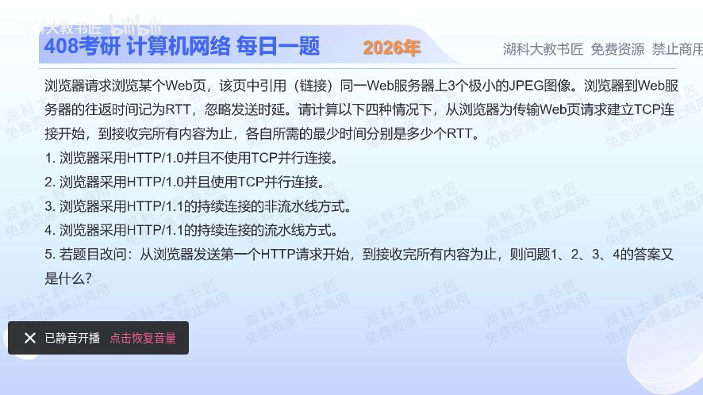

[目录](README.md)　·　[« 2025-1119](1119.md)　·　[2025-1122 »](1122.md)

# 2025-11-21

[原视频](https://www.bilibili.com/video/BV1D6yFBcEsV/)

<!-- review-lesson -->

## 先合上解析

用“首次连接／HTML／图片批次”画四行时间，不背8、4、5、3。起算点改变只删除哪一段？

展开解析与逐项判断

页面本身1个对象，另有3张图；必须先收到HTML才知道图片请求。忽略发送时延、DNS/TLS等题外开销，首次TCP建连占1RTT，每批请求/响应占1RTT。

（1）HTTP/1.0串行非持久：4个对象各2RTT，共**8RTT**。（2）非持久但允许三图并行连接：HTML2RTT，三图同时建连并请求共2RTT，总**4RTT**；这里假定并发连接数至少3。

（3）HTTP/1.1持久非流水线：只建一次1RTT，HTML及三图依次各1RTT，总**5RTT**。（4）持久流水线：建连1RTT+HTML1RTT+三图请求流水线一批1RTT，共**3RTT**。

（5）起算点改为第一个HTTP请求发出，首次建连已完成，四种结果都减去最初的1RTT，依次**7、3、4、2RTT**。不能把每张图另建连接的成本也删掉。

这些是题设的HTTP/1.x理想时序，不是现代浏览器包含TLS、HTTP/2多路复用、对象大小时的统一测速公式。

只核对复盘检查

只删第一个TCP握手1RTT，不删之后非持久连接新建成本。

## 换一个条件

图片从3张增加到5张，且允许5张并发，四种从建连起算时间分别多少？

完成后核对

串行非持久12RTT；并行非持久4RTT；持久非流水线7RTT；持久流水线3RTT。

关联：[网页邮箱的HTTP](1029.md)。

[复习入口](../../review/README.md) · 解析已补全，个人是否掌握以独立作答为准。
