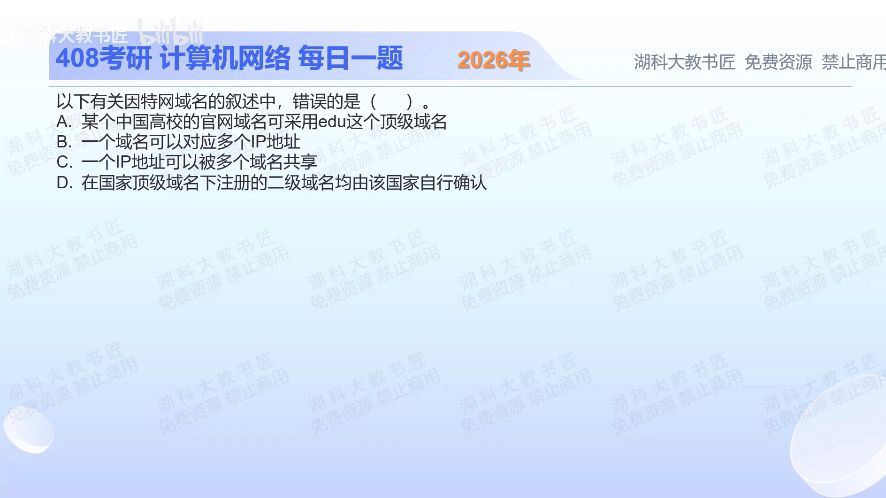

[目录](README.md)　·　[« 2025-1121](1121.md)　·　[2025-1123 »](1123.md)

# 2025-11-22

[原视频](https://www.bilibili.com/video/BV1oCyMBcE3c/)

<!-- review-lesson -->

## 先合上解析

example.edu.cn中顶级域是哪一段？一个域名多IP与一个IP多域名是否矛盾？

展开解析与逐项判断

题目错误项按现行.edu新注册资格选 **A**。.edu不是世界上任何高校都可申请的通用教育标签；EDUCAUSE的新注册资格主要限美国、满足认可认证要求的高等教育机构。中国高校通常使用edu.cn，其中顶级域是cn，edu是其下层级；两者不能混同。

B正确：同域名可有多个A/AAAA等地址记录，用于多地址部署等；C正确：多个域名可以解析到同一IP，Web服务器再按Host或TLS SNI等区分站点；D按教材指国家代码顶级域的下级命名/注册政策由其管理方制定，不是全球统一固定二级分类。

.edu历史上有2001年政策调整前已注册并获保留资格的例外，不能把A的判断扩大成“历史上绝无非美国持有人”。本题按当前普通新注册规则理解。

只核对复盘检查

顶级域cn；二者分别是DNS映射不同方向的多重关系，不矛盾。

## 换一个条件

两个网站解析到同一个IP，浏览器访问时服务器可凭HTTP哪个字段区分目标站点？

完成后核对

HTTP/1.1的Host字段；HTTPS建立TLS时常用SNI先选择证书/虚拟主机。

关联：[HTTP会话](0921.md)。

取证边界：[EDUCAUSE .edu eligibility](https://net.educause.edu/eligibility.htm)与其历史保留资格政策；资格是注册政策，需与DNS协议本身分开。

[复习入口](../../review/README.md) · 解析已补全，个人是否掌握以独立作答为准。
