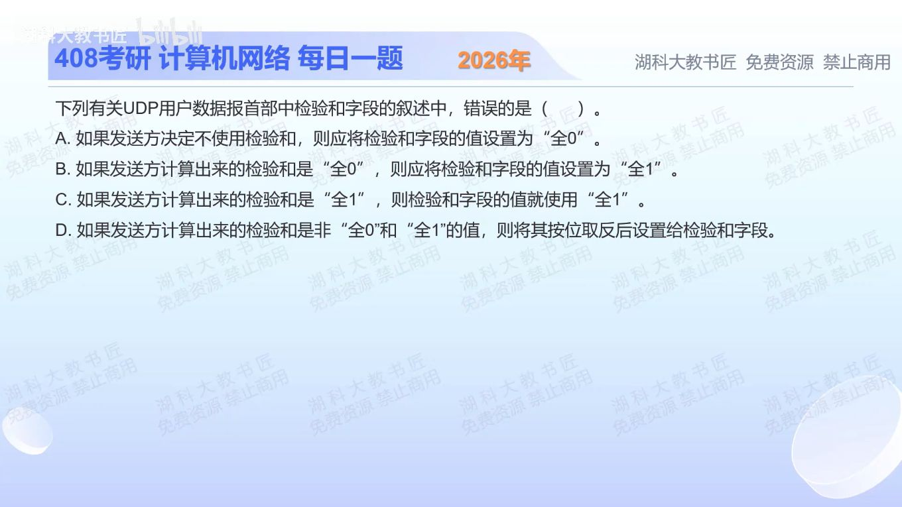

[目录](README.md)　·　[« 2025-1122](1122.md)　·　[2025-1124 »](1124.md)

# 2025-11-23

[原视频](https://www.bilibili.com/video/BV1qcUWBSECu/)

<!-- review-lesson -->

## 先合上解析

若最终校验值为0x1234，字段填什么？若最终值为0x0000，为什么不能原样填？

展开解析与逐项判断

这里“计算出来的检验和”指反码求和后已经取反的最终校验值，而不是尚未取反的中间和。对IPv4 UDP：不用检验和可把字段置0；若实际算出的最终校验值恰为0，则线上改写为全1，以免与“不用检验和”混淆。

所以A正确（限IPv4可选检验和口径）；B正确；C算得全1就填全1也正确；D说一般最终校验值还要再取反一次，错误，选 **D**。

必须分清三步：先求带回卷的和，再取反得到校验值，最后处理UDP的“0改全1”。不能在已取反的结果上重复取反。IPv6通常不允许像A这样省略检验和。

只核对复盘检查

填0x1234；0要编码为0xFFFF，保留0作为IPv4 UDP未启用检验和标记。

## 换一个条件

若中间反码和为0xEDCB，最终校验字段是多少？

完成后核对

先取反得到0x1234，非0即可直接填0x1234，不能再反回0xEDCB。

关联：[UDP反码和步骤](1022.md)；[实际字节校验](1116.md)。

取证边界：[RFC 768](https://www.rfc-editor.org/rfc/rfc768.html)。

[复习入口](../../review/README.md) · 解析已补全，个人是否掌握以独立作答为准。
