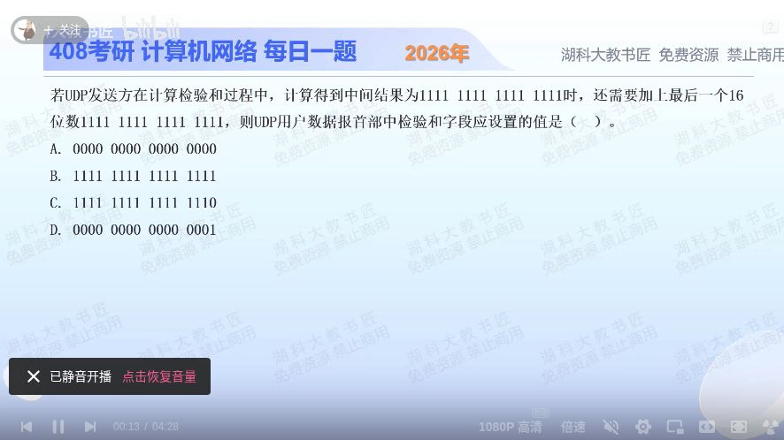

[目录](README.md)　·　[« 2025-1123](1123.md)　·　[2025-1125 »](1125.md)

# 2025-11-24

[原视频](https://www.bilibili.com/video/BV1e6UKBFEFb/)

<!-- review-lesson -->

## 先合上解析

不看选项，以十六进制写四个中间值，指出哪步是UDP特有。

展开解析与逐项判断

先计算反码和：0xFFFF+0xFFFF=0x1FFFE，最高进位1回卷到低16位，得到0xFFFF。再逐位取反，得到最终校验值0x0000。

UDP对“算得的零校验值”有特殊编码：发送字段填0xFFFF，避免与IPv4 UDP字段全0表示未启用检验和混淆。因此选 **B**。A停在数学校验值没做UDP编码；C只保留普通加法低16位；D把中间步骤和取反规则混乱。

顺序是加法→回卷→取反→UDP零值映射，这四步每一步都能成为出错点。

只核对复盘检查

1FFFE→FFFF→0000→FFFF；最后一步是UDP零值编码。

## 换一个条件

若中间和为0xFFFE，最后一个字仍0xFFFF，最终UDP字段是多少？

完成后核对

相加0x1FFFD，回卷0xFFFE，取反0x0001，直接填0x0001。

关联：[零值与全1](1123.md)。

[复习入口](../../review/README.md) · 解析已补全，个人是否掌握以独立作答为准。
