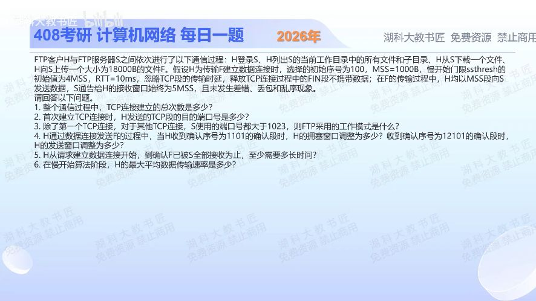

[目录](README.md)　·　[« 2025-1124](1124.md)　·　[2026-0907 »](../2026/0907.md)

# 2025-11-25

[原视频](https://www.bilibili.com/video/BV1sSU1B4EG1/)

<!-- review-lesson -->

## 先合上解析

用段号画每轮发送组，先分清cwnd与min(cwnd,rwnd)。为什么18段用了6个数据批次？

展开解析与逐项判断

（1）登录建立并保持1条控制连接；列目录、下载文件、上传F各需要1条数据连接，共**4条TCP连接**。（2）首次连接是控制连接，H发向S的目的端口**21**。（3）其余数据连接中S端口都>1023，而不是主动模式常见服务器数据端口20，按题意是**被动模式PASV**，由客户端连接服务器告知的数据端口。

（4）SYN初始序号100占1，首数据从101开始；ACK1101确认首个1000B。按教材初始cwnd=1MSS、每数据段确认、无丢包模型，cwnd增至2MSS。ACK12101确认前12000B，即前12段，轮次窗口轨迹为1、2、4（到ssthresh）、5、6……；此时cwnd到6MSS，但rwnd仅5MSS，**有效发送窗口为5MSS**。拥塞窗口和发送窗口不能混为一谈。

（5）从发起数据连接算：t=0 SYN；t=10ms完成主动端握手并可发第1段；t=20发2—3；t=30发4—7；t=40发8—12；t=50发13—17；t=60发18；t=70ms收到末段确认。第三次握手未禁止携带首段数据，因此最少**70ms**；不另计后续FIN关闭，因为终点只是确认F已收完。

（6）在教材将达到阈值的4MSS窗口计入慢开始末轮的口径下，最大轮平均速率为4×1000B/10ms=400000B/s=**3.2Mb/s**。跨到拥塞避免后不能继续翻倍；发送窗口后续还受5MSS通告窗口限制。

本题未明给初始cwnd，以上按考试经典初值1MSS与逐RTT整数增长模型；现代TCP初始窗口、逐ACK细节不同，不能据此预测实际FTP测速。

只核对复盘检查

1+2+4+5+5+1=18，后段被rwnd5限制；第12段确认后cwnd6但有效窗5。

## 换一个条件

若rwnd改为无限大而保持经典窗口模型，18段何时确认完？

完成后核对

各批1、2、4、5、6，合计18；t10/20/30/40/50ms发送，t60ms末段确认。

关联：[慢开始与瓶颈](1110.md)；[握手字节编号](1118.md)。

[复习入口](../../review/README.md) · 解析已补全，个人是否掌握以独立作答为准。
