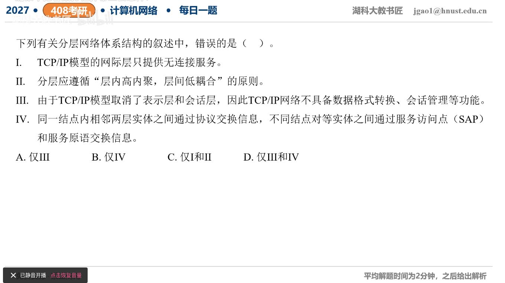

[目录](README.md)　·　[« 2025-1125](../2025/1125.md)　·　[2026-0908 »](0908.md)

# 2026-09-07

[原视频](https://www.bilibili.com/video/BV1p2b46oEBq/)

<!-- review-lesson -->

## 先合上解析

把协议与服务分别放在横向和纵向。某层没有独立命名能否推出功能不存在？

展开解析与逐项判断

Ⅰ正确：TCP/IP网际层IP提供无连接数据报服务，不保证可靠性。Ⅱ正确：层内高内聚使同类功能集中，层间低耦合使接口变化影响较小。

Ⅲ错误：TCP/IP没有把表示层与会话层独立列出，不代表数据格式转换和会话管理功能消失；它们可由应用及相关库/协议实现。Ⅳ错误：同一节点上下层通过服务访问点和服务原语使用服务；不同节点的对等实体遵守协议进行逻辑通信，题中正好颠倒。

错误为Ⅲ、Ⅳ，选 **D**；A、B各漏一项，C错误地包含Ⅰ且漏Ⅳ。协议偏“横向对等规则”，服务偏“纵向层间能力”，但对等通信实际仍须依赖下层传送。

只核对复盘检查

横向协议、纵向服务；分层组织形式变化不等于应用功能被删除。

## 换一个条件

浏览器程序调用TLS库进行数据保护，是否证明TCP/IP必须另列一个表示层？

完成后核对

不能；功能可集成在应用相关实现中，体系结构是否单独划层是另一问题。

关联：[物理接口四类特性](../2025/1005.md)。

[复习入口](../../review/README.md) · 解析已补全，个人是否掌握以独立作答为准。
