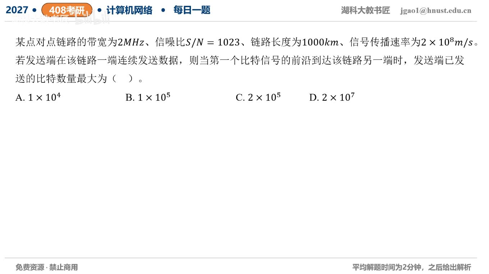

[目录](README.md)　·　[« 2026-0907](0907.md)　·　[2026-0909 »](0909.md)

# 2026-09-08

[原视频](https://www.bilibili.com/video/BV1EqbN6sE5Y/)

<!-- review-lesson -->

## 先合上解析

依次写容量、传播时间、乘积的单位。1023是线性功率比还是分贝？

展开解析与逐项判断

题目问首比特前沿刚到对端时已经发出了多少比特，即发送速率×单程传播时间的最大值。先用香农公式：C=2MHz×log₂(1+1023)=2×10⁶×10=20Mb/s。

1000km=10⁶m，传播时间τ=10⁶/(2×10⁸)=0.005s=5ms。最大已发送量Cτ=20×10⁶×0.005=**100000bit，选B**。A数量少10倍；C把单程误用往返；D是速率数值20×10⁶，还没乘时间。

题目明确前沿到达，所考的是在途流水线容量，不需要再加一整帧发送时延。不要把MHz直接写成Mb/s，也不要把1023当dB再转换。

只核对复盘检查

20Mb/s、5ms、100000bit；1023已是线性S/N。

## 换一个条件

带宽翻倍而距离减半，信噪比不变，最大在途比特量如何变化？

完成后核对

容量翻倍、传播时间减半，乘积不变，仍100000bit。

关联：[同类香农与BDP](../2025/1008.md)。

[复习入口](../../review/README.md) · 解析已补全，个人是否掌握以独立作答为准。
