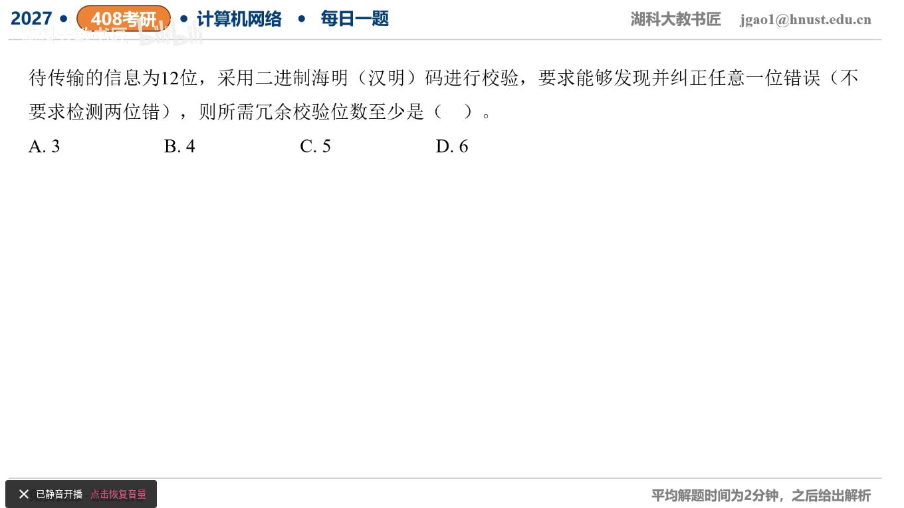

[目录](README.md)　·　[« 2026-0908](0908.md)　·　[2026-0910 »](0910.md)

# 2026-09-09

[原视频](https://www.bilibili.com/video/BV1Xqbg6fE2M/)

<!-- review-lesson -->

## 先合上解析

为什么11位信息用4位校验可能够，12位却不够？

展开解析与逐项判断

普通二进制海明纠单错需要r个校验位给出2^r种综合症，至少覆盖12+r个可能错误位置加1种无错状态：2^r≥12+r+1。

r=3时8<16，不够；r=4时16<17，差一个状态；r=5时32≥18，满足，所以最少 **5位，选C**。A、B不够，D不是最少。原题明确不要求双错检测，不要另加SECDED的整体奇偶位。

最常见错误是只要求2^r≥12或≥13，忘记校验位自己也可能翻转，需要被定位。

只核对复盘检查

11+4+1=16刚好；12+4+1=17超过16，必须升到5位。

## 换一个条件

若信息长度为26位，普通纠单错校验位至少多少？

完成后核对

r5时32≥26+5+1=32，恰好5位。

关联：[11位信息海明效率](../2025/0911.md)；[具体综合症](../2025/0913.md)。

[复习入口](../../review/README.md) · 解析已补全，个人是否掌握以独立作答为准。
