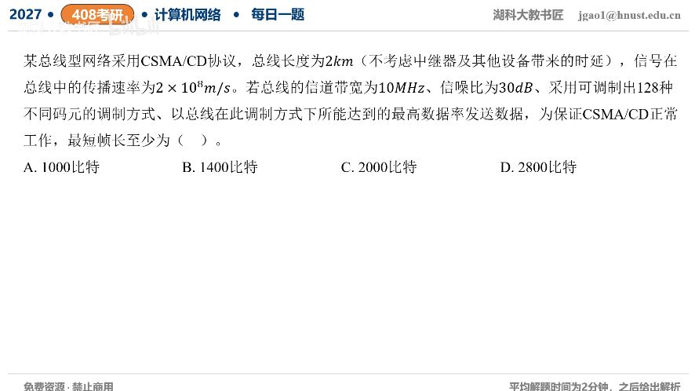

[目录](README.md)　·　[« 2026-0909](0909.md)　·　[2026-0911 »](0911.md)

# 2026-09-10

[原视频](https://www.bilibili.com/video/BV1PmYh67ENC/)

<!-- review-lesson -->

## 先合上解析

两种容量哪个更紧？为什么碰撞检测要乘往返，而前一道在途量只乘单程？

展开解析与逐项判断

需要同时满足两种速率上限。128个状态每符号7bit，奈奎斯特上限2Wlog₂128=2×10MHz×7=140Mb/s。SNR30dB转换成1000，香农上限10MHz×log₂1001≈99.672Mb/s，取更小值约100Mb/s，不能只用140。

总线2km、传播速率2×10⁸m/s，单程10μs；为了最远端碰撞传回前仍在发送，最短发送时间≥往返20μs。因此最短帧长约99.672×10⁶×20×10⁻⁶=1993.45bit，整数下界1994bit；四个选项中最小满足的是 **2000bit，选C**。A、B不够；D来自只取奈氏140Mb/s，虽更长却不是选项中最小。

教材常近似log₂1001≈10，直接得2000bit。本题要记住先取两上限之小，再乘2τ；这是总线CSMA/CD模型，不是现代全双工交换链路。

只核对复盘检查

香农更紧；碰撞信息要去最远端再返回发送者，需2τ，首比特单程到达只需τ。

## 换一个条件

若总线缩为1km且其他不变，精确比特下界和选项式近似会怎样？

完成后核对

均减半，约996.72bit取整997bit，按容量约100Mb/s的教材近似为1000bit。

关联：[香农/奈氏约束](../2025/1009.md)；[争用期](../2025/1105.md)。

[复习入口](../../review/README.md) · 解析已补全，个人是否掌握以独立作答为准。
