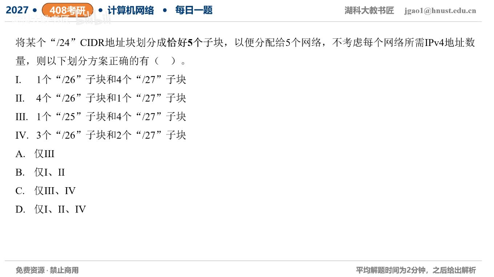

[目录](README.md)　·　[« 2026-0910](0910.md)　·　[2026-0912 »](0912.md)

# 2026-09-11

[原视频](https://www.bilibili.com/video/BV16eYu62E9m/)

<!-- review-lesson -->

## 先合上解析

用末字节区间给Ⅲ、Ⅳ各摆一次，确认没有重叠、没有缺口。

展开解析与逐项判断

完整把/24划成5块，必须满足块数5、容量和256、CIDR对齐且不重叠。/25为128个地址，/26为64，/27为32。

Ⅰ64+4×32=192，漏64个地址，不是完整划分；Ⅱ4×64+32=288，超出原块；Ⅲ128+4×32=256，能用一半/25和另一半内4个/27实现；Ⅳ3×64+2×32=256，能把前三个/26保留、最后一个/26二分实现。所以Ⅲ、Ⅳ正确，选 **C**；A漏Ⅳ，B、D包含容量不符方案。

只加容量一般不够，还需边界对齐。本题Ⅲ和Ⅳ都能具体摆放，所以确实可行。

只核对复盘检查

Ⅲ0—127、128—159、160—191、192—223、224—255；Ⅳ0—63、64—127、128—191、192—223、224—255。

## 换一个条件

若只说“取出5个子块”而允许留下空闲空间，Ⅰ还一定错误吗？

完成后核对

不一定；Ⅰ可合法取出192个地址并留64未分配。完整划分这一措辞决定是否允许缺口。

关联：[实际需求分配](../2025/1106.md)；[五块最小容量](../2025/1018.md)。

[复习入口](../../review/README.md) · 解析已补全，个人是否掌握以独立作答为准。
