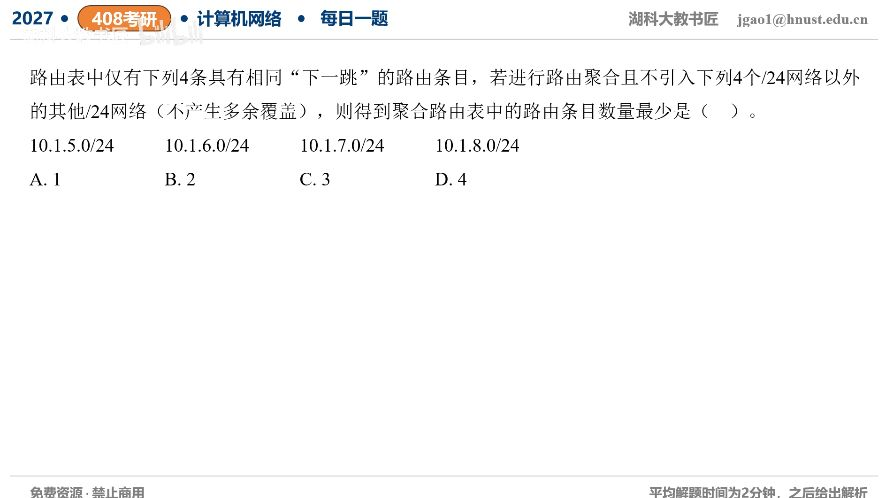

[目录](README.md)　·　[« 2026-0911](0911.md)　·　[2026-0913 »](0913.md)

# 2026-09-12

[原视频](https://www.bilibili.com/video/BV1iaY56WEZd/)

<!-- review-lesson -->

## 先合上解析

为什么6与7可以合而5与6不可以？给出聚合后实际覆盖的末字节前缀范围。

展开解析与逐项判断

要求不产生多余覆盖，不能只找四个地址的公共大前缀。第三字节5=00000101、6=00000110、7=00000111、8=00001000。6和7是对齐的一对，可聚合为10.1.6.0/23。

5若与4配对才可组成/23，但4不在原集合；8若与9配对也会多覆盖9。因此必须保留10.1.5.0/24与10.1.8.0/24，最终共**3条，选C**：5/24、6/23、8/24。A、B需要额外覆盖，D没有尽量合并。

相邻数字不一定能CIDR合并；必须块大小相同、地址连续且起点按合并后长度对齐。

只核对复盘检查

6是偶数/23起点，覆盖第三字节6—7；5/6跨两个/23边界。

## 换一个条件

若原路由变成10.1.4.0/24到10.1.7.0/24四条，最少几条？

完成后核对

1条10.1.4.0/22，起点4按4个/24一组对齐，恰覆盖4—7。

关联：[允许额外覆盖的聚合题](../2025/1102.md)。

[复习入口](../../review/README.md) · 解析已补全，个人是否掌握以独立作答为准。
