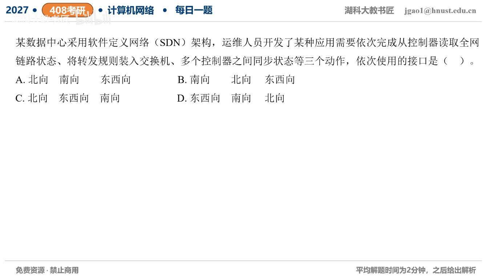

[目录](README.md)　·　[« 2026-0912](0912.md)　·　[2026-0914 »](0914.md)

# 2026-09-13

[原视频](https://www.bilibili.com/video/BV1s2Y96jEWS/)

<!-- review-lesson -->

## 先合上解析

分别写出三次交互的两端角色，不借助箭头朝上/朝下猜名字。

展开解析与逐项判断

先认接口两端，而不是看“读取”就以为方向朝下。（1）应用从控制器获取全网链路状态，是应用↔控制器，北向接口。（2）控制器将转发规则下装到交换机，是控制器↔数据平面设备，南向接口。（3）多个控制器之间同步状态，是同层控制器↔控制器，东西向接口。

顺序北向、南向、东西向，选 **A**。B颠倒前两者；C把控制器间同步与设备控制互换；D把应用获取信息误判为东西向。

接口名称描述体系结构角色，不等于单次报文流向。南向接口也会从交换机向控制器报告统计和事件，北向接口也有请求与响应。

只核对复盘检查

应用—控制器北向；控制器—交换机南向；控制器—控制器东西向。

## 换一个条件

交换机向控制器上传端口计数器，用北向还是南向接口？

完成后核对

南向。数据从下往上流不改变接口属于控制器与交换机这一边界。

关联：[服务与协议分层](0907.md)。

[复习入口](../../review/README.md) · 解析已补全，个人是否掌握以独立作答为准。
