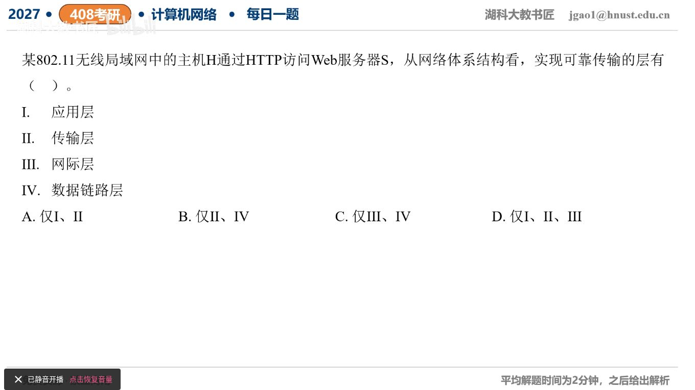

[目录](README.md)　·　[« 2026-0913](0913.md)　·　[2026-0915 »](0915.md)

# 2026-09-14

[原视频](https://www.bilibili.com/video/BV1kRYY6nEPo/)

<!-- review-lesson -->

## 先合上解析

无线链路已经重传，为什么仍需TCP端到端重传？

展开解析与逐项判断

按HTTP/1.x或HTTP/2经TCP的题目常规模型：传输层TCP提供端到端确认、重传、按序交付等可靠传输机制；802.11链路层对普通单播帧有确认和重传，提供局部链路的可靠传输机制。网际层IP只提供尽力而为数据报；HTTP应用语义本身不是本题要选的下层可靠传送机制。

因此选Ⅱ、Ⅳ，即 **B**。A错含应用层且漏无线链路层；C错含IP层；D也错含IP层并漏链路层。

“可靠”不等于无限失败后仍保证必达：802.11有重试限制，链路ACK也不能证明数据已到远端Web应用。若题意改为HTTP/3，QUIC在UDP之上实现可靠传输机制，需要明确不同承载，不能机械说HTTP永远依赖TCP。

只核对复盘检查

链路只覆盖一跳且重试有限；其他跳、路由器拥塞等仍可丢失，需要端到端机制。

## 换一个条件

若把802.11改为普通以太网，链路层是否通常替发送方自动重传坏帧？

完成后核对

普通以太网用FCS检错并丢弃坏帧，不提供与802.11单播ACK同样的链路重传；TCP端到端机制仍在。

关联：[UDP与应用可靠性](../2025/0910.md)。

[复习入口](../../review/README.md) · 解析已补全，个人是否掌握以独立作答为准。
