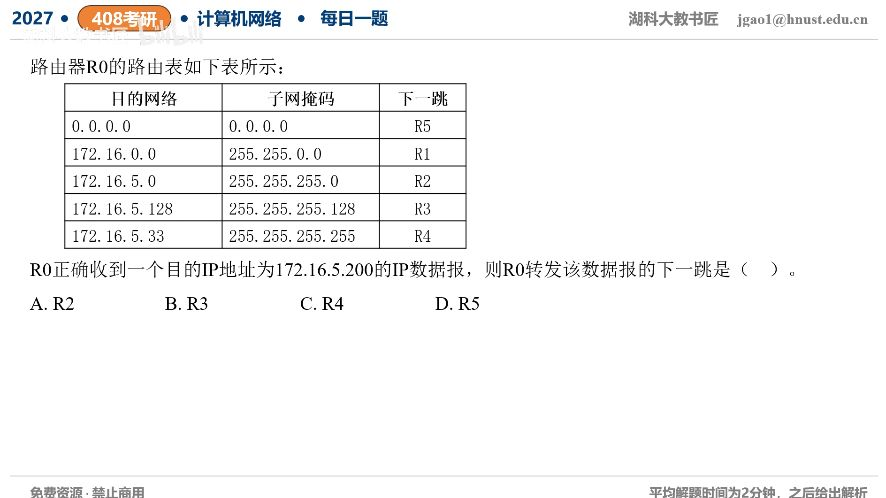

[目录](README.md)　·　[« 2026-0914](0914.md)　·　[2026-0916 »](0916.md)

# 2026-09-15

[原视频](https://www.bilibili.com/video/BV1YTeL6pE9Z/)

<!-- review-lesson -->

## 先合上解析

把每项标成匹配/不匹配，再在匹配项里写前缀长度。/32为何不参加最后比较？

展开解析与逐项判断

目的172.16.5.200分别匹配默认/0、172.16.0.0/16、172.16.5.0/24、172.16.5.128/25。最后一项/32只匹配172.16.5.33，与.200无关，不能因为前缀最长就选它。

在匹配项中最长的是/25，覆盖.128—.255，下一跳R3，因此选 **B**。A的R2虽匹配但/24较短；C的R4根本不匹配；D默认R5仅当无更具体匹配时才用。

正确流程是“先过滤匹配，再选最长”，不是无条件选表里最长掩码，也不是表从上到下第一个命中就结束。

只核对复盘检查

/32目的.33与.200不同；最长匹配为/25→R3。

## 换一个条件

目的改成172.16.5.33、172.16.5.100、172.17.1.1时下一跳各是谁？

完成后核对

.33命中/32→R4；.100命中/24但不命中/25→R2；172.17.1.1无特定项→默认R5。

关联：[聚合与精确路由共存](../2025/1102.md)。

[复习入口](../../review/README.md) · 解析已补全，个人是否掌握以独立作答为准。
