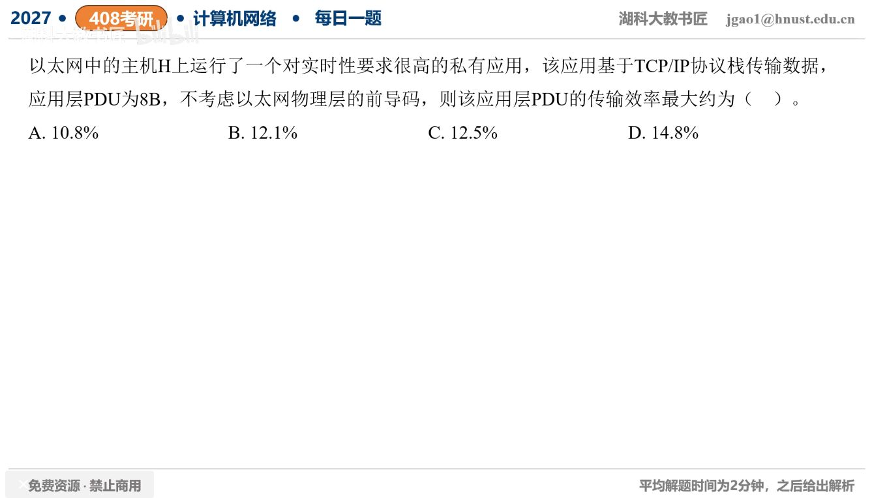

[目录](README.md)　·　[« 2026-0915](0915.md)　·　[2026-0917 »](0917.md)

# 2026-09-16

[原视频](https://www.bilibili.com/video/BV14zex63EmJ/)

<!-- review-lesson -->

## 先合上解析

先算36B再比较46B，填充处在哪一层？填充算不算应用有效数据？

展开解析与逐项判断

题目实时性高、私有应用允许选择轻量传输，按最大效率选择UDP8B首部、IPv4最小20B首部。8B应用数据加UDP和IP为36B，低于以太网最小载荷46B，需填充10B。

线上MAC帧至少14B首部+46B载荷（含填充）+4B FCS=64B，题目排除前导码。原应用PDU只有8B，效率8/64=**12.5%，选C**。A、B不是本题最小64B帧的比例；D约14.8%=8/54，漏了以太网必需填充。

不能把实时性等同于所有应用必选UDP；这里是在题设私有应用可用UDP的条件下求最大值。即使原IP包仅36B，也不能发送54B的普通最小以太网帧。

只核对复盘检查

在以太网载荷末尾补10B，不属于IP总长，也不算8B应用内容。

## 换一个条件

若应用PDU改成20B，仍UDP+IPv4、无选项，最大效率是多少？

完成后核对

IP包20+8+20=48B，无需填充；帧总66B，20/66≈30.30%。

关联：[较大OSPF封装效率](../2025/1004.md)；[截图中未展示填充](../2025/1116.md)。

[复习入口](../../review/README.md) · 解析已补全，个人是否掌握以独立作答为准。
