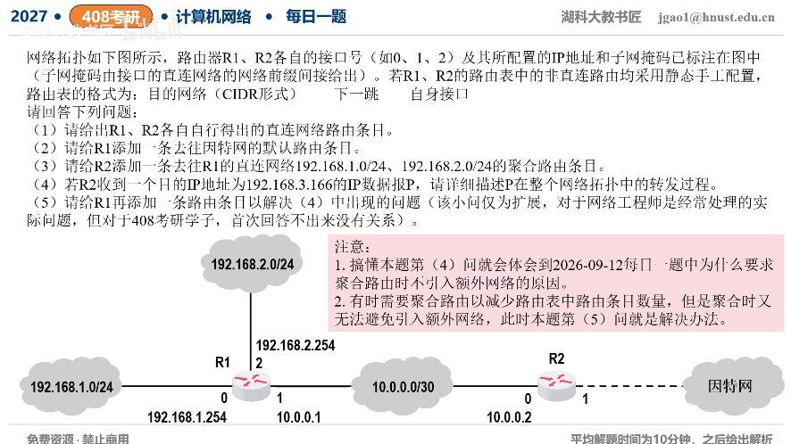

[目录](README.md)　·　[« 2026-0916](0916.md)　·　[2026-0918 »](0918.md)

# 2026-09-17

[原视频](https://www.bilibili.com/video/BV1jfeA6FEUw/)

<!-- review-lesson -->

## 先合上解析

把.1.10与.3.166各走一遍：在R1谁的前缀最长？新增黑洞为什么不误杀真实LAN？

展开解析与逐项判断

（1）R1自动形成三条直连：192.168.1.0/24→直接、接口0；10.0.0.0/30→直接、接口1；192.168.2.0/24→直接、接口2。R2已知直连10.0.0.0/30→直接、接口0；其接口1接因特网但地址/前缀未给，不能凭空写出具体直连网络。

（2）R1默认路由0.0.0.0/0→10.0.0.2、接口1。（3）R2去R1两侧LAN的单条最小公共聚合为192.168.0.0/22→10.0.0.1、接口0；第三字节1与2的公共前缀为6位，整体22位，覆盖.0—.3，不能误写.1.0/23。

（4）目的192.168.3.166命中R2的/22，被送R1；R1没有该目的的直连或更具体路由，使用默认项送回R2；于是循环R2→R1→R2，TTL逐跳减，最终丢弃并通常返回ICMP时间超过。

（5）给R1增加聚合前缀的丢弃路由：192.168.0.0/22→Null0（黑洞/丢弃接口）。实际.1/24、.2/24更具体，仍按直连正常转发；额外覆盖的.0/.3命中/22被丢弃，不再落入/0回送。若只修复本次.3.166也可加192.168.3.0/24丢弃，但/22丢弃能保护整个聚合缺口。

聚合并不自动证明块内每个地址都可达。需要真实明细路由优先、空洞流量就地终止，才能避免与上游默认路由形成环路。

只核对复盘检查

真实LAN有/24优先；空洞只有/22黑洞优先于/0，停止转发。

## 换一个条件

如果未来R1新增192.168.3.0/24真实直连网络，必须删除/22黑洞才可访问它吗？

完成后核对

不必，新的/24自动比/22更具体，可正常到达；黑洞仍保护其他未覆盖部分。

关联：[精确聚合](0912.md)；[最长匹配](0915.md)。

[复习入口](../../review/README.md) · 解析已补全，个人是否掌握以独立作答为准。
