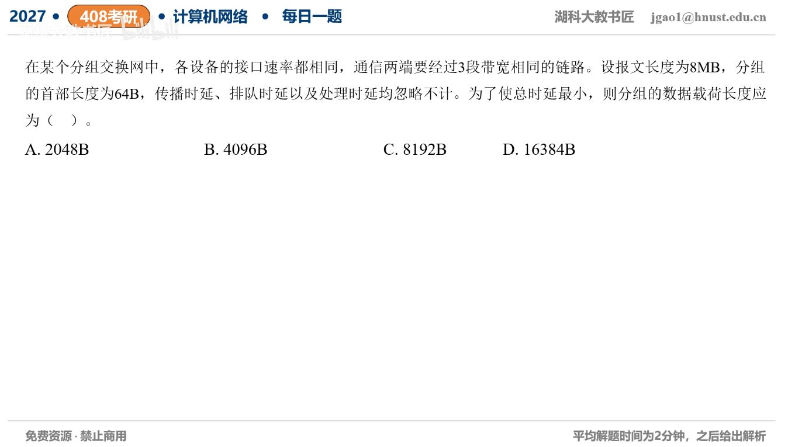

[目录](README.md)　·　[« 2026-0917](0917.md)　·　[2026-0919 »](0919.md)

# 2026-09-18

[原视频](https://www.bilibili.com/video/BV1fNek6BEYf/)

<!-- review-lesson -->

## 先合上解析

不背根号：解释为什么是n+2而不是3n，再从表达式找一大一小两种代价。

展开解析与逐项判断

设原数据M=8MB，每包有效数据xB、首部h=64B，共n=M/x包。三段等速存储转发：首包要3次发送时间，之后每包只再加一次，所以总发送轮数n+2。

总时间T=(M/x+2)(x+h)/R。展开后与x有关的部分为Mh/x+2x，最小点满足Mh/x=2x，即x=√(Mh/2)。按本题二进制M，x=√(8×2²⁰×64/2)=**16384B，选D**。其他三个包长更小，重复首部开销更大；逐项代入也可确认D最短。

若采用十进制MB，连续最优为16000B，给定选项中仍是16384B最优。题问的是数据载荷x，不是含64B首部的总包长。

只核对复盘检查

流水线首包多经过2段；重复首部Mh/x随x变小增加，流水线尾部2x随x变大增加。

## 换一个条件

只改为两段链路，理论最优数据长度怎样变化？

完成后核对

x=√(Mh)，为原三段最优的√2倍，不是直接两倍。

关联：[两段最优分组](../2025/1001.md)。

[复习入口](../../review/README.md) · 解析已补全，个人是否掌握以独立作答为准。
