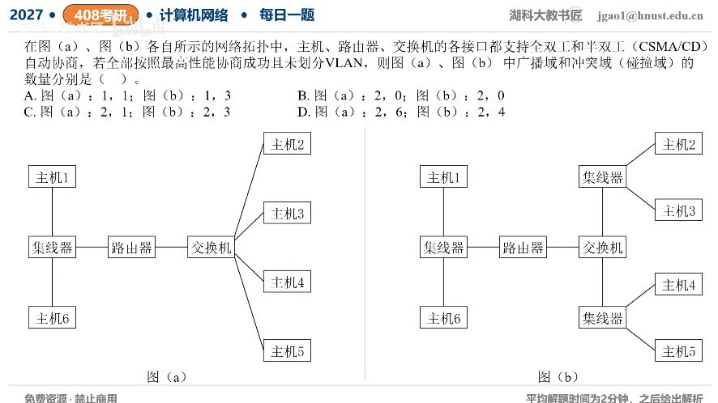

[目录](README.md)　·　[« 2026-0918](0918.md)　·　[2026-0920 »](0920.md)

# 2026-09-19

[原视频](https://www.bilibili.com/video/BV1z9e26HE6N/)

<!-- review-lesson -->

## 先合上解析

先标Hub连到的全部共享段，再把其他直连交换链路标全双工。广播能跨哪台设备？

展开解析与逐项判断

题中特别给“按最高性能自动协商成功”，所以普通主机—交换机和交换机—路由器链路用全双工，不运行CSMA/CD；只有连接Hub的共享网段仍半双工，会发生碰撞。

两图都由路由器隔开左右广播，且没有VLAN，所以广播域均2个。图(a)左边一个Hub形成1个冲突域，右边全双工交换链路无碰撞，合计1；图(b)左边Hub一个，右边两个Hub各一个，合计3。选 **C：图(a)2、1；图(b)2、3**。

A忽略路由器隔离广播；B误以为Hub也能全双工而把冲突数算0；D机械把所有交换机端口都计作实际碰撞域，忽略明确给出的全双工条件。教材有时把每个交换端口称为隔离的“冲突域”，本题显式以碰撞机制为口径，必须跟着双工条件判断。

只核对复盘检查

Hub段3个或1个才有碰撞；路由器隔离广播，交换机不划VLAN则不隔广播。

## 换一个条件

若图(a)把左Hub换成二层交换机，仍最高性能协商，广播域与实际碰撞域多少？

完成后核对

仍2个广播域；所有链路全双工，实际碰撞域0个。

关联：[双工条件影响计数](../2025/1105.md)。

[复习入口](../../review/README.md) · 解析已补全，个人是否掌握以独立作答为准。
