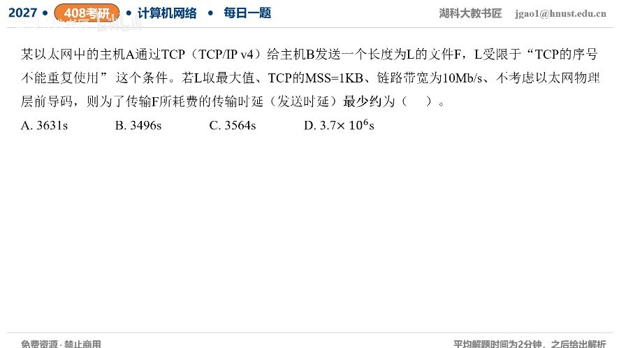

[目录](README.md)　·　[« 2026-0919](0919.md)　·　[2026-0921 »](0921.md)

# 2026-09-20

[原视频](https://www.bilibili.com/video/BV1ieee62E6u/)

<!-- review-lesson -->

## 先合上解析

每个1024B数据要付哪四项封装开销？写出B到b转换，说明为什么这不是实际完成文件传输的墙钟时间。

展开解析与逐项判断

按题目“文件数据使用的TCP字节序号不能重复”模型，32位序号覆盖2³²B，最大文件约4GiB。MSS=1KiB=1024B，需2³²/2¹⁰=2²²个数据段。

每个满段最少加TCP20B、IPv4 20B、以太网首部14B及FCS4B，共1024+58=1082B。不计前导码，全部数据帧的发送时延为2²²×1082×8/(10×10⁶)≈**3630.59s，选A约3631s**。

B约3496s接近只加以太网18B而漏TCP/IP；C约3564s接近只加TCP/IP40B而漏以太网；D数量级错误。不能只拿文件长度除10Mb/s，也不能把MSS当完整帧长。

题目求发送时延下界，未给ACK等待、拥塞、传播等耗时，不把它们加进去；若严格把连接控制位也纳入“不复用序号”条件，会差少数字节，不改变此近似选项。

只核对复盘检查

TCP20、IP20、MAC14、FCS4；乘8后除比特速率。实际还可能受窗口/RTT/重传影响。

## 换一个条件

如果只在原计算中加每帧8B前导码，发送时延需增加多少？

完成后核对

2²²×8×8/10⁷≈26.84s；题目已明确不计，原答案不能擅自包含。

关联：[TCP序号绕回](../2025/1030.md)；[分层有效比例](0916.md)。

[复习入口](../../review/README.md) · 解析已补全，个人是否掌握以独立作答为准。
