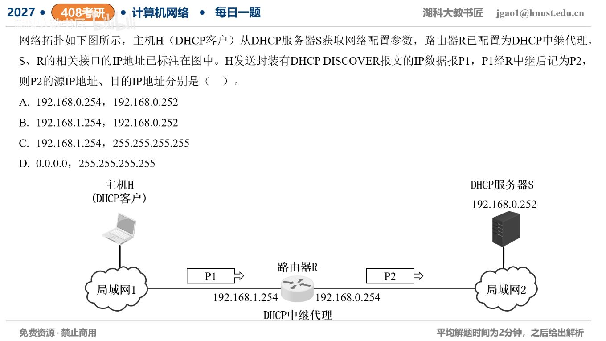

[目录](README.md)　·　[« 2026-0920](0920.md)　·　[2026-0922 »](0922.md)

# 2026-09-21

[原视频](https://www.bilibili.com/video/BV1Duei6rEbm/)

<!-- review-lesson -->

## 先合上解析

对比P1与P2的IP端点，并指出服务器选择客户端地址池主要需要哪个中继字段。

展开解析与逐项判断

H尚未获址时，P1是0.0.0.0→255.255.255.255的本地DHCP广播。R作为中继收到后，重新向配置好的服务器192.168.0.252发单播；不能把受限广播直接跨路由器转发。

按教材常用“中继以接收客户端请求的接口地址作源”模型，P2源192.168.1.254、目的192.168.0.252，选 **B**。该客户端侧接口地址也填入DHCP/BOOTP的giaddr，使服务器据此识别客户端所在子网并把答复送回中继。C、D仍保留广播目的，未体现中继到服务器的单播。

严格区分两个字段：giaddr明确承担客户端侧网络标识；外层IP源地址可受中继实现/源地址配置影响。RFC 1542 §4.1.1规定的是giaddr填接收接口地址，不能据此把它等同于所有实现的外层IP源地址规则；设备还可能提供中继源接口配置。A应放在具体实现与配置下判断。本题B依赖默认教材行为，不能把“出口接口一定作源”或“源一定恒等giaddr”当无条件标准。

只核对复盘检查

P1零源到广播；P2默认以客户端侧中继地址到服务器单播；giaddr指示客户端子网。

## 换一个条件

若显式配置中继外层源为192.168.0.254，而giaddr仍192.168.1.254，应据哪个字段识别客户端所属网段？

完成后核对

通常仍看giaddr（还可能结合标准中继选项/服务器策略），不能只凭外层源把地址分到服务器侧网段。

关联：[DHCP初次申请](../2025/0909.md)。

取证边界：[RFC 1542 §4.1.1](https://www.rfc-editor.org/rfc/rfc1542.html#section-4.1.1)；[RFC 2131](https://www.rfc-editor.org/rfc/rfc2131.html)。

[复习入口](../../review/README.md) · 解析已补全，个人是否掌握以独立作答为准。
