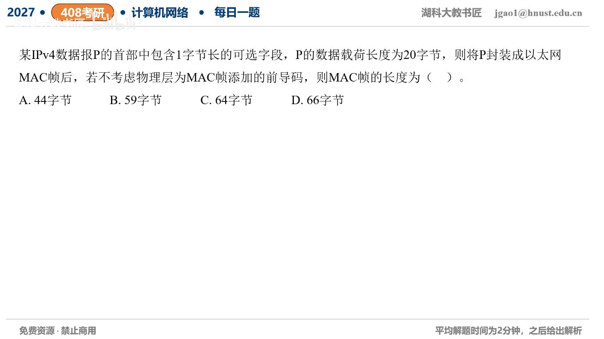

[目录](README.md)　·　[« 2026-0921](0921.md)　·　[2026-0923 »](0923.md)

# 2026-09-22

[原视频](https://www.bilibili.com/video/BV1HthB64EjY/)

<!-- review-lesson -->

## 先合上解析

在纸上写两行：IP内部20+1+3+20；MAC外部14+44+2+4。谁能从IP总长度看到哪种填充？

展开解析与逐项判断

第一种填充在IP首部：固定20B+选项1B=21B，要按4B对齐，补3B，首部总24B。再加IP载荷20B，整个IP数据报44B。

第二种填充在以太网载荷：44B低于最小46B，再补2B。MAC帧总14B首部+46B载荷+4B FCS=**64B，选C**。A只算IP包44B；B通常由未按IP首部对齐又漏MAC填充得到；D多加了不需要的字节。

两种填充服务于不同层的约束：IP的3B属于IP首部/总长，MAC的2B不属于IP数据报。不要把它们混成“统一补到64”。

只核对复盘检查

IP总长44能看到首部3B填充，不能把MAC补2B算入IP总长。

## 换一个条件

若IP数据载荷改成24B，其他不变，帧长是多少？

完成后核对

IP包24+24=48B，不需MAC填充，帧长14+48+4=66B。

关联：[2B选项的IHL](../2025/1117.md)；[最小帧效率](0916.md)。

[复习入口](../../review/README.md) · 解析已补全，个人是否掌握以独立作答为准。
