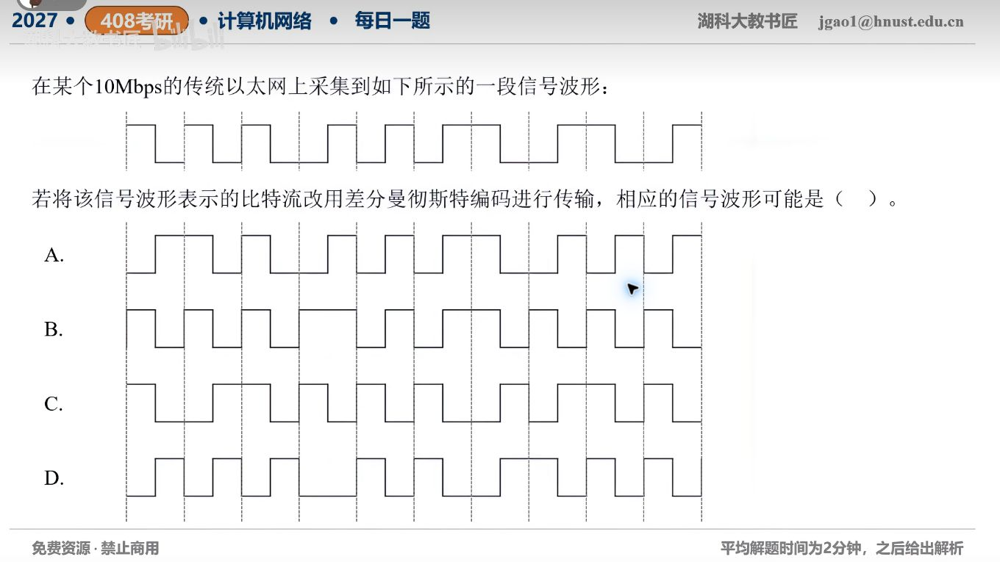

[目录](README.md)　·　[« 2026-09-23](0923.md)　·　[2026-09-25 »](0925.md)

# 2026-09-24

[原视频](https://www.bilibili.com/video/BV1G1h46LEhz/)

考点：曼彻斯特转差分曼彻斯特波形。解析待核对；先依据题图独立作答，暂不把本题计入已解析数。

[返回年表](README.md) · [总目录](../README.md)
