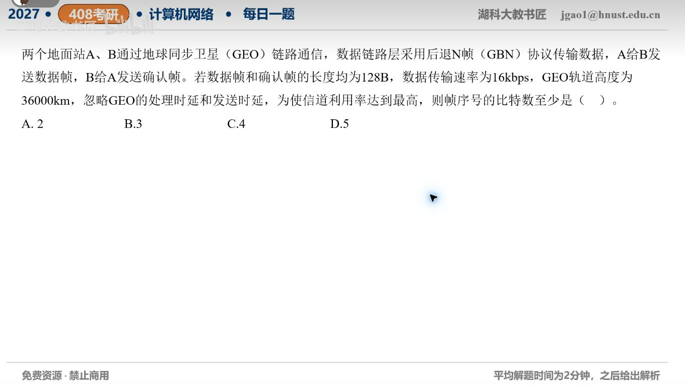

[目录](README.md)　·　[« 2026-09-24](0924.md)　·　[2026-09-26 »](0926.md)

# 2026-09-25

[原视频](https://www.bilibili.com/video/BV1DYaw6gEYb/)

考点：卫星链路GBN序号位数。解析待核对；先依据题图独立作答，暂不把本题计入已解析数。

[返回年表](README.md) · [总目录](../README.md)
