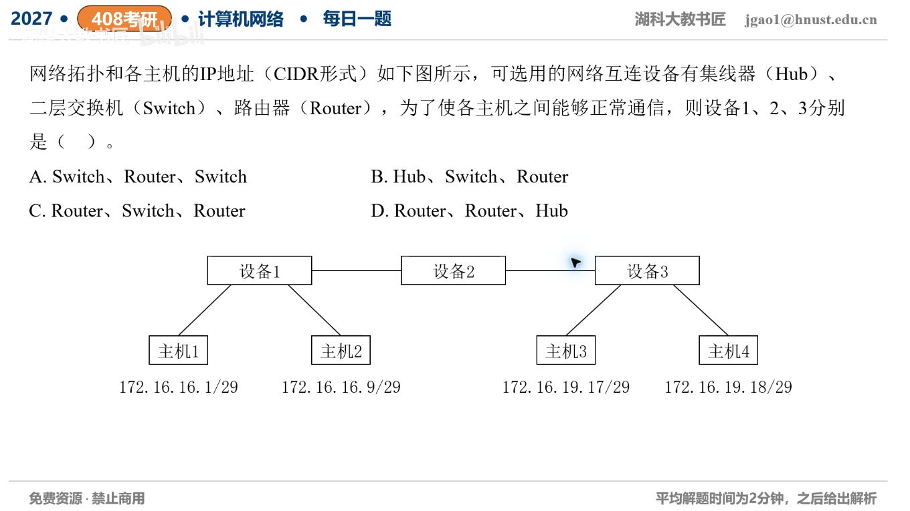

[目录](README.md)　·　[« 2026-09-27](0927.md)　·　[2026-09-29 »](0929.md)

# 2026-09-28

[原视频](https://www.bilibili.com/video/BV1s9h16QE7U/)

考点：拓扑中集线器、交换机、路由器选择。解析待核对；先依据题图独立作答，暂不把本题计入已解析数。

[返回年表](README.md) · [总目录](../README.md)
