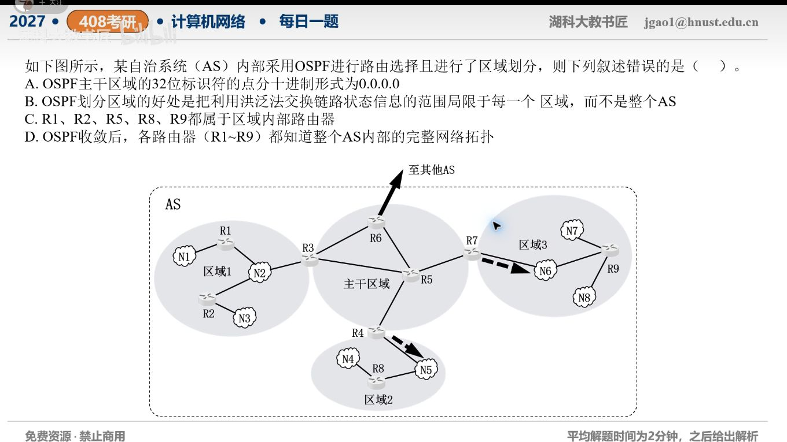

[目录](README.md)　·　[« 2026-09-28](0928.md)　·　[2026-09-30 »](0930.md)

# 2026-09-29

[原视频](https://www.bilibili.com/video/BV1K9h16XEPw/)

考点：OSPF区域与链路状态数据库。解析待核对；先依据题图独立作答，暂不把本题计入已解析数。

[返回年表](README.md) · [总目录](../README.md)
