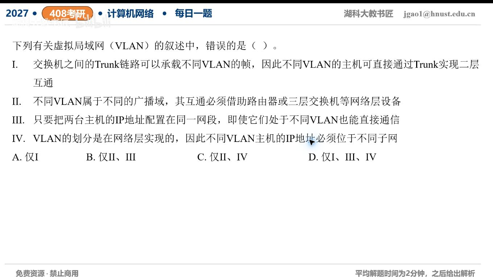

[目录](README.md)　·　[« 2026-09-29](0929.md)　·　[2026-10-01 »](1001.md)

# 2026-09-30

[原视频](https://www.bilibili.com/video/BV1y9h16QEQp/)

考点：VLAN与广播域、三层转发。解析待核对；先依据题图独立作答，暂不把本题计入已解析数。

[返回年表](README.md) · [总目录](../README.md)
