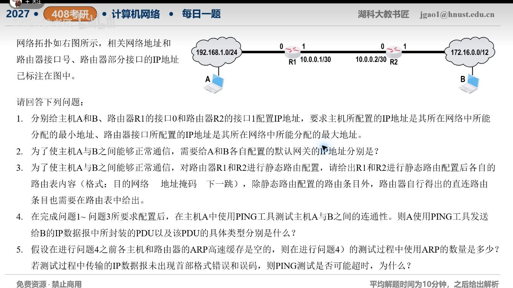

[目录](README.md)　·　[« 2026-10-03](1003.md)　·　[2026-10-05 »](1005.md)

# 2026-10-04

[原视频](https://www.bilibili.com/video/BV1x5HY6tECb/)

考点：跨网段路由、ARP与Ping综合题。解析待核对；先依据题图独立作答，暂不把本题计入已解析数。

[返回年表](README.md) · [总目录](../README.md)
