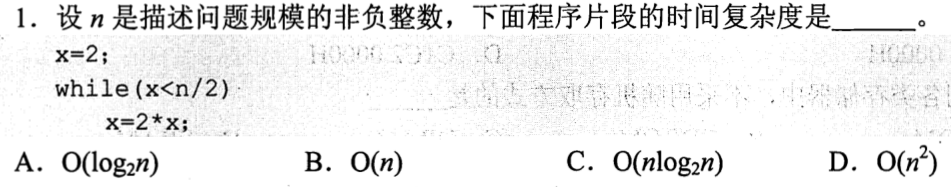
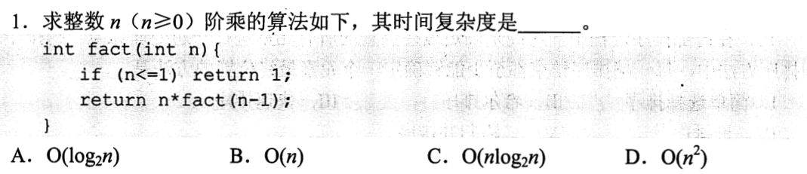
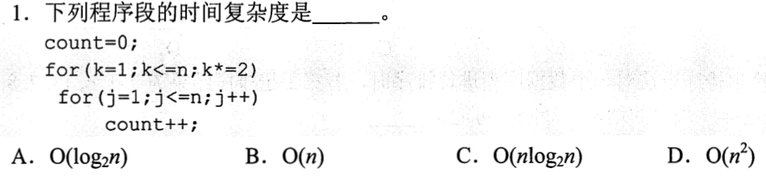
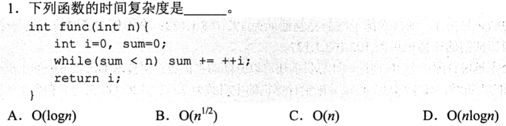
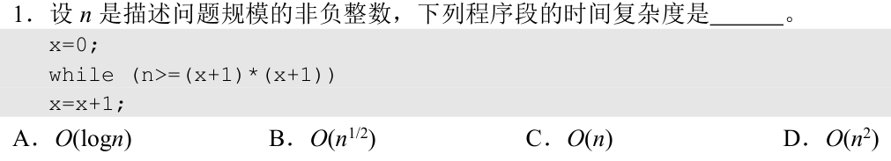
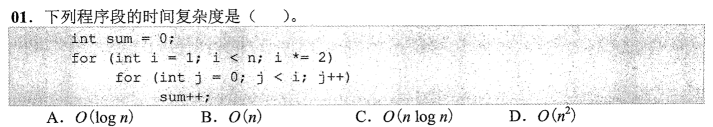
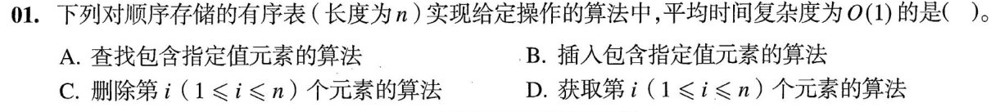
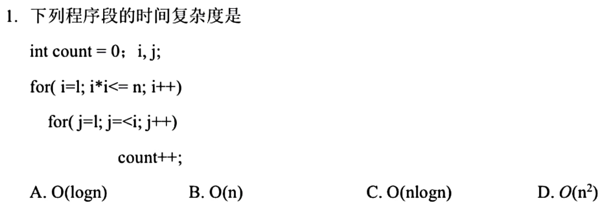

[0801-answer »](0801-answer.md)

# 0731 Answer｜增长量级

> 原题：[0731 题单](0731.md)｜[九题考场路线与保底](0731-route.md)｜教学上下文：[0731-context.md](answer-quality/0731-context.md)｜质量门槛：[quality-gate.md](answer-quality/quality-gate.md)

**进入本篇时已有**：会读循环和递归代码；知道 `O(·)` 只看随 `n` 增长的趋势、忽略常数倍。
**读完新增**：写变量轨迹 · 数递归调用 · 构造无代码过程 · 两层循环何时相乘 · 由停止条件反解轮数 · 逐轮求和 · 顺序存储的“定位+搬移”。

<details>
<summary>本篇速览（9 题：新增台阶 · 起手 · 最易错）</summary>

| # | 新增台阶 | 起手 | 最易错 → 先看什么 |
|---|---|---|---|
| [01](#q01) | 写轨迹，数到边界 | 写 `x` 的前几个值 | 以为 `n/2` 改了量级 → 看更新是乘还是加 |
| [02](#q02) | 递归改数调用次数 | 展开 `fact(n)` 两三层 | 把返回值 `n!` 当时间 → 数调用，每次最多再调一次就是一条链 |
| [03](#q03) | 无代码题自己搭过程；头插反序 | 手合 `1,3,5` 与 `2,4` | 以为最好情况更快 → 降序时剩余部分要逐个头插 |
| [04](#q04) | 内层不含外层变量才能乘 | 列出每个 `k` 对应的内层次数 | 见两层就写 `n²` → 外层翻倍，只有 `log n` 行 |
| [05](#q05) | 对着停止条件的变量求轮数 | 手跑前几轮，`i`、`sum` 各一列 | 见 `++i` 写 `O(n)` → 条件里是 `sum` |
| [06](#q06) | 轮数 = 终点 ÷ 步长 | 把条件解成 `x` 的范围 | 见 `x++` 写 `n`、见平方写 `n²` → 先解条件得终点 |
| [07](#q07) | 内层含外层变量→逐轮求和；值≠轮次 | 外层 `i` 与内层次数列两行 | `log n × n` 或 `log²n` → `i` 是值不是轮次 |
| [08](#q08) | 操作 = 定位 + 之后的活 | 每项问：定位多快？要搬吗？ | 位置已知就当 `O(1)` → 删除后要搬移 |
| [09](#q09) | 06 的终点 + 07 的求和 | 先解外层边界，再列内层 | 外层当成 `n` 轮 → 先解 `i*i<=n`；粗估要看各轮是否接近最大项 |

**三个反复出现的信号**：看到 `x++` 先看终点（01/05/06）· 见两层循环先看内层条件有无外层变量（04 vs 07）· 变量的值不等于轮次（07）。

</details>


<a id="q01"></a>
## 01｜写出变量轨迹，数到边界：倍增是对数



> **新增**：时间 = 循环体执行了几次；用变量的前几个值估出次数
> **起手**：写 `x` 的轨迹　→　**答案 A**

被数的动作是循环体 `x=2*x`。写 `x` 的值：

```text
x:  2 → 4 → 8 → 16 → … → 2^k
指数:  1   2   3    4        k
```

每轮指数只 +1，到 `n/2` 只需指数走到 `log₂(n/2) = log₂n − 1`。所以次数约 `log₂n − 2`，是 `Θ(log n)`。

`n/2` 只让次数少一两轮，不改变量级。

| 选项 | 成立需要什么 | 本题 |
|---|---|---|
| **A** `log n` | 每轮乘一个固定倍数 | ✓ `x=2*x` |
| B `n` | 每轮只加常数（`x++`、`x+=2`） | ✗ 是乘法 |
| C `n log n` | 外面还有一层 ~`n` 轮 | ✗ 只有一个循环 |
| D `n²` | 两层各 ~`n` 轮 | ✗ 只有一个循环 |

> 条件改成 `x=x+2`，轨迹变成 `2, 4, 6, …`，次数 ~`n/4`，立刻变线性。判断靠**更新方式**，不靠循环的外观。

---

<a id="q02"></a>
## 02｜递归：总时间 = 调用次数 × 每次自己做的活



> **沿用**：01 的“写出前几步”，这次写的是调用而不是变量
> **新增**：递归没有循环可数，改数**调用了几次**，再乘每次自己的开销
> **起手**：把 `fact(n)` 展开两三层　→　**答案 B**

```text
fact(n)      → 调用 fact(n-1)
 fact(n-1)   → 调用 fact(n-2)
  …
   fact(1)   → 直接 return 1
```

- 每个 `fact(k)` 自己只做一次比较 + 一次乘法，是常数。
- 每个 `fact(k)` 只再调用**一次**，调用链没有分叉，共 `n` 层。

`n × O(1) = O(n)`。

题目问的是步数，不是返回值。`n!` 极大，但算出它只用 `n` 次乘法。

| 选项 | 成立需要什么 | 本题 |
|---|---|---|
| A `log n` | 每层参数减半（`n/2`） | ✗ 参数是 `n-1` |
| **B** `n` | 一条链 × 每层常数 | ✓ |
| C `n log n` | 如 `log n` 层、每层做 `n` 的活 | ✗ 每层只有常数 |
| D `n²` | `n` 层、每层再做 ~`n` 的活 | ✗ 每层没有循环 |

> 信号：看**每次调用最多再调用几次**。只要不超过一次，就是一条链，不会指数增长。出现 `f(n-1)+f(n-2)` 这类一次调用两个子调用，才会分叉。

---

<a id="q03"></a>
## 03｜没有代码：自己搭出合并过程，数每个结点被摘几次


> **沿用**：01 的“数动作次数”；02 的“每个对象的开销”
> **新增**：无代码题要自己构造最朴素的过程。链表里**头插**会把顺序反过来，所以“降序”决定了每个结点都要被摘一次
> **起手**：用 `A=1,3,5`、`B=2,4` 手合一次，结果要降序　→　**答案 D**

**先看升序合并升序（作对照）**

两个指针 `p`、`q` 各指向两表当前最小的结点，比较后把较小的接到结果**尾部**，该指针后移。一边用完后，另一边剩余部分已经是升序，**整段直接挂上去**，一次指针修改。

**本题要降序：用头插**

头插把新结点放在结果最前面：

```c
s->next = L->next;   // 新结点指向原来的第一个结点
L->next = s;         // 头指针改指新结点
```

先摘下的小结点会被后来的大结点压到后面，结果自然是降序：

```text
摘 1   结果: 1
摘 2   结果: 2 → 1
摘 3   结果: 3 → 2 → 1
摘 4   结果: 4 → 3 → 2 → 1
A 剩 5 结果: 5 → 4 → 3 → 2 → 1    ← 剩余的 5 也要单独头插
```

关键在最后一行：剩余部分是升序，而结果要降序，所以不能整段挂上，必须**逐个**头插。每个结点恰好被摘一次，每次 `O(1)`，总计 `m+n` 次，与最好最坏无关。

| 选项 | 成立需要什么 | 本题 |
|---|---|---|
| A `O(n)` | 总量只与第二表长度有关 | ✗ `m` 很大时总量远大于 `n` |
| B `O(mn)` | 一表每个结点都和另一表每个结点比较 | ✗ 指针只前进不回头，每次比较后必有一个结点退出 |
| C `O(min(m,n))` | 剩余部分可整段挂接 | ✗ 那是**升序**合并的最好情形；降序时剩余也要逐个摘 |
| **D** `O(max(m,n))` | 总量 `m+n` | ✓ |

`m+n` 与 `max(m,n)` 同阶，因为 `max ≤ m+n ≤ 2·max`。

> 陷阱：题干写“最坏情况”，容易让人以为最好情况更快。但降序下最好情况也是 `m+n`。把“降序”改成“升序”，题意才分出最好 `min(m,n)` 与最坏 `m+n`。

---

<a id="q04"></a>
## 04｜两层循环：内层与外层变量无关，才能直接相乘



> **沿用**：01 的倍增轨迹（外层 `k`）
> **新增**：两层循环何时 = 轮数 × 每轮次数
> **起手**：写出 `k` 的每个值，以及对应内层跑几次　→　**答案 C**

被数的动作是 `count++`；`count` 的最终值恰好就是执行次数。

```text
k = 1   → j 跑 n 次
k = 2   → j 跑 n 次
k = 4   → j 跑 n 次
…         （k 翻倍，共约 log₂n 行）
```

每行都是 `n`，共 `log₂n + 1` 行，总计 `n(log₂n + 1) = Θ(n log n)`。

**能乘的判据**：内层的条件里没有外层变量。这里内层是 `j<=n`，与 `k` 无关，每行次数相同。

| 选项 | 本题 |
|---|---|
| A、B | ✗ 漏掉了一层 |
| **C** `n log n` | ✓ |
| D `n²` | ✗ 需要外层也有 ~`n` 行；这里外层是翻倍，只有 `log n` 行 |

> 变式边界：把内层条件改成 `j<=k`，每行次数就不同了，这个判据失效。见 07。

---

<a id="q05"></a>
## 05｜停止条件看的是累计量：先求 t 轮后的累计值，再反解 t



> **沿用**：01 写轨迹；04 先分清“数什么”
> **新增**：循环条件里的变量（`sum`）和每轮 +1 的变量（`i`）不是同一个，要对着条件那个变量求轮数
> **起手**：手跑前几轮，两个变量各写一列　→　**答案 B**

`sum += ++i`：先把 `i` 加 1，再把新的 `i` 加进 `sum`。

| 轮 | `i` | `sum` |
|---:|---:|---:|
| 1 | 1 | 1 |
| 2 | 2 | 3 |
| 3 | 3 | 6 |
| 4 | 4 | 10 |
| t | t | `t(t+1)/2` |

循环在 `sum ≥ n` 时停：

```text
t(t+1)/2 ≈ n   →   t ≈ √(2n)   →   O(√n)
```

核对：`n=100` 时，13 轮后 `sum=91`，14 轮后 `sum=105`，停；`√200 ≈ 14.1`。

**为什么不是 `O(n)`**：`i` 每轮 +1，容易当成要走到 `n`。但条件检查的是 `sum`；`sum` 每轮的增量是 `1,2,3,…`，越加越大，远早于 `i` 到 `n` 就超过 `n`。

| 选项 | 成立需要什么 | 本题 |
|---|---|---|
| A `log n` | `sum` 每轮翻倍 | ✗ 只是逐轮多加一点 |
| **B** `√n` | 累计量按 `t²` 增长 | ✓ |
| C `n` | `sum` 每轮加常数（如 `sum+=1`） | ✗ 增量在变大 |
| D `n log n` | 嵌套结构 | ✗ 单层循环 |

<details>
<summary>考场忘了求和公式时</summary>

`1+2+…+t` 的平均项约 `t/2`，共 `t` 项，总和约 `t²/2`。只要看出是 `t²` 量级，令它等于 `n` 即可。

</details>

---

<a id="q06"></a>
## 06｜条件里的平方：它在决定终点，不是工作量



> **沿用**：05 从停止条件反解轮数
> **新增**：轮数 = 终点 ÷ 步长；条件里的运算只改终点
> **起手**：把条件 `n >= (x+1)*(x+1)` 解成 `x` 的范围　→　**答案 B**

`x` 每轮 +1（步长 1）。继续的条件：

```text
(x+1)² ≤ n   ⟺   x+1 ≤ √n
```

`x` 取 `0, 1, 2, …, ⌊√n⌋−1`，共 `⌊√n⌋` 轮。核对：`n=100`，`x` 取 `0..9`，共 10 轮 = `√100`。

两条错误路线方向相反：

| 想法 | 偷用的前提 | 失效点 |
|---|---|---|
| 有 `x++` → `O(n)` | `x` 要走到 `n` | 条件里的终点是 `√n` |
| 有平方 → `O(n²)` | 平方是工作量的平方 | 平方在**判断里**，每轮只做一次乘法和比较，没有第二层循环 |

选项 A、C 分别需要乘法式更新和更多层，这里都没有。**选 B**。

> 变式边界：条件改成 `(x+1)³ ≤ n`，终点变成 `n^(1/3)`；步长改成 `x=2*x`，就回到 01 的对数。

---

<a id="q07"></a>
## 07｜内层上界依赖外层：逐轮写出次数再相加



> **沿用**：01 的倍增轨迹；04 的“能乘的判据”
> **新增**：内层上界含外层变量时，04 的乘法失效，必须逐轮求和；程序变量的**值**不是**轮次**
> **起手**：把外层 `i` 的值和内层次数列成两行　→　**答案 B**

取 `n=17`：外层 `i = 1, 2, 4, 8, 16`，内层 `j<i`：

```text
i       : 1   2   4   8   16
内层次数 : 1   2   4   8   16     合计 31 ≈ 2n
```

一般地，设 `L` 是小于 `n` 的最大 2 的幂：

```text
1 + 2 + 4 + … + L = 2L − 1 ,      n/2 ≤ L < n
```

总量在 `n−1` 到 `2n` 之间，是 `Θ(n)`。

**直觉**：翻倍数列里最后一项就占总和一半以上。最后一轮内层只做 `L < n` 次，前面所有轮加起来也不超过它。

| 想法 | 偷用的前提 | 失效点 |
|---|---|---|
| `log n` 轮 × 内层最大 `n` → `n log n` | 每轮内层都是 `n` 次 | 内层是当前 `i`，前面各轮只有 1、2、4… |
| `log n` 轮 × 每轮 `log n` → `log²n` | 把 `i` 当轮次编号（第 `k` 轮做 `k` 次） | 第 `k` 轮时 `i = 2^(k−1)` |

```text
轮次   : 1  2  3  4  5
i 的值 : 1  2  4  8  16      ← 做的次数跟着 i，不跟轮次
```

04 能乘，是因为内层条件里没有 `k`。这里内层条件里有 `i`，所以不能乘。**选 B**；A、D 都与逐轮求和的结果不符（`n²` 需要每轮 ~`n` 次）。

<details>
<summary>严格一点：为什么 L 满足 n/2 ≤ L < n</summary>

外层循环条件是 `i<n`，所以 `L` 是小于 `n` 的最大 2 的幂，`L<n`。若 `L<n/2`，则 `2L<n`，`2L` 也满足条件，与 `L` 最大矛盾。所以 `L ≥ n/2`。`n` 恰为 2 的幂时 `L=n/2`，总和 `n−1`。

</details>

---

<a id="q08"></a>
## 08｜顺序存储：一个操作 = 定位 + 之后还要做的活



> **沿用**：03 的“数每个对象被碰几次”（这里数的是被搬移的元素）
> **新增**：顺序存储的两条性质，一是下标直接算地址，二是要保持连续就必须搬移
> **起手**：对每个选项先问：定位多快？定位后要不要搬东西？　→　**答案 D**

顺序存储就是连续存放的数组：

```text
第 i 个元素的地址 = 首地址 + (i − 1) × 每个元素的大小
```

一次乘加，与 `n` 无关，不用从头数。所以**按序号取元素**是 `O(1)`。

| 选项 | 定位 | 定位之后 | 总量 |
|---|---|---|---|
| A 查找指定值 | 有序可折半 `O(log n)` | 无 | `O(log n)` ✗ |
| B 插入指定值 | 折半 `O(log n)` | 后面元素整体后移，平均约 `n/2` 个 | `O(n)` ✗ |
| C 删除第 `i` 个 | 直接算地址 `O(1)` | 后面元素整体前移 | `O(n)` ✗ |
| **D** 取第 `i` 个 | `O(1)` | 无 | `O(1)` ✓ |

**“有序”帮的是按值查找**（可折半）。它不帮按序号取（序号本身已足够），也救不了搬移。

C 的陷阱：位置已知，很容易以为整个操作是 `O(1)`。但删除后为保持连续，后面的元素都要前移。只有删最后一个才不用搬，按平均算仍是 `O(n)`。

> 边界：换成链表，情形反过来：取第 `i` 个要从头数，`O(n)`；已知位置时插入、删除只改指针，`O(1)`。

---

<a id="q09"></a>
## 09｜综合：06 的终点 + 07 的逐轮求和



> **沿用**：06 从条件解出终点；07 内层依赖外层时逐轮列出再加
> **新增**：两步串起来；并看清**什么时候“轮数 × 最大一轮”也恰好给出正确量级**
> **起手**：先解外层 `i*i<=n`，再把内层次数列出　→　**答案 B**

外层：`i*i ≤ n` ⟹ `i` 从 1 走到 `m = ⌊√n⌋`。第 `i` 轮内层做 `i` 次：

```text
i    : 1  2  3  …  m
内层 : 1  2  3  …  m          合计 m(m+1)/2 ≈ n/2
```

核对：`n=100`，`m=10`，总和 55。所以是 `Θ(n)`，**选 B**。

其余选项：A 需要整体只有对数轮；C、D 需要外层有 ~`n` 轮，而条件 `i*i<=n` 把外层压到 `√n` 轮。

**这一题里直接用“`√n` 轮 × 每轮最多 `√n`”也得到 `n`，为什么这里能用、07 里不能用？**

| | 各轮次数 | 项数 | 最大项 | 项数 × 最大项 | 真实总和 |
|---|---|---|---|---|---|
| 07 | `1, 2, 4, …, L` | `log n` | `≈n` | `n log n` | `≈n` |
| 09 | `1, 2, 3, …, √n` | `√n` | `√n` | `n` | `≈n/2` |

等差数列里，大量项都和最大项同量级，总和约是“项数 × 最大项”的一半，同阶，粗估有效。等比数列里，只有最后几项大，前面都很小，粗估会高估一个 `log n` 倍。

> 判据：想用“轮数 × 最大一轮”前，先看各轮次数是不是大多接近最大值。拿不准，就列出来求和。

---

[0801-answer »](0801-answer.md)
